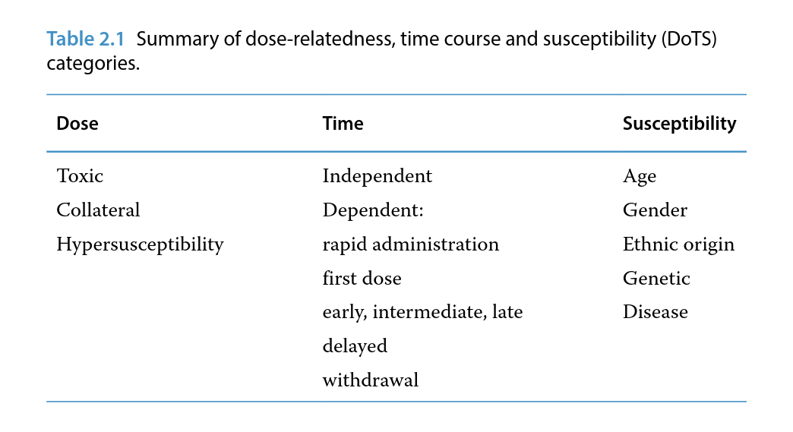
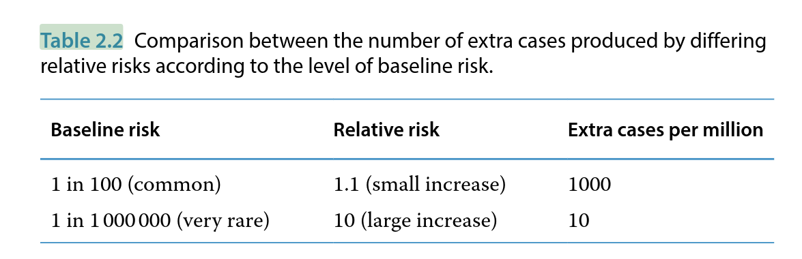
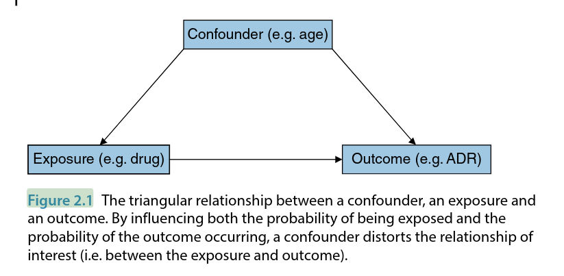

# Basic Concepts - Intro to PhV - 2

1. [Basic Concepts - Intro to PhV - 2](#basic-concepts---intro-to-phv---2)
   1. [Adverse Drug Reactions](#adverse-drug-reactions)
      1. [Definitions](#definitions)
      2. [Classification Systems](#classification-systems)
      3. [DoTS Classification](#dots-classification)
   2. [Nature and Mechanisms of ADRs](#nature-and-mechanisms-of-adrs)
      1. [Predisposing Factors for ADRs](#predisposing-factors-for-adrs)
      2. [Drug Interactions](#drug-interactions)
   3. [The Concept of Safety](#the-concept-of-safety)
      1. [Definition](#definition)
      2. [Measuring Risk](#measuring-risk)
      3. [Safety in Practice](#safety-in-practice)
      4. [Risk-Benefit Balance](#risk-benefit-balance)
      5. [Lack of Benefit](#lack-of-benefit)
   4. [Causation - Was the Drug Responsible?](#causation---was-the-drug-responsible)
      1. [Causality Assessment in Individual Cases](#causality-assessment-in-individual-cases)
      2. [Assessing Causality from Clinical Trial Data](#assessing-causality-from-clinical-trial-data)
      3. [Causality in Non‐Randomised Studies - The Problems of Bias and Confounding](#causality-in-nonrandomised-studies---the-problems-of-bias-and-confounding)
      4. [Using the Bradford Hill Criteria to Assess Causality](#using-the-bradford-hill-criteria-to-assess-causality)
   5. [Conclusions](#conclusions)

The two most important concepts in pharmacovigilance are opposites: harm and safety. The usual term for harm related to a medicine is an adverse drug reaction (ADR). As pharmacovigilance is fundamentally about preventing and managing ADRs, this concept is considered first through a summary of relevant definitions, classification systems that have been proposed, their nature and mechanisms and predisposing factors. Subsequently, the concept of safety is defined and discussed, particularly in the context of balancing harms with benefits. Finally, we consider the issue of causation how we go about deciding whether or not a patient has experienced an ADR or whether a medicinal product really is responsible for an apparent safety problem.

## Adverse Drug Reactions

### Definitions

Standard, internationally agreed definitions of side effect, ADR and adverse event can be paraphrased as follows:

- A side effect is an unintended effect of a medicine. Normally, it is undesirable but it could be beneficial (e.g. an anxiolytic effect from a beta‐blocker prescribed for hypertension).
- An adverse drug reaction (ADR) is an unintended and noxious effect that is attributable to a medicine when it has been given within the normal range of doses used in humans.
- An adverse event (AE) is an undesirable occurrence that occurs in the context of drug treatment but which may or may not be causally related to a medicine.

The difference between an ADR and an AE is crucial and yet these terms are widely misused. In practice, determining whether a drug is responsible for a particular AE in an individual patient is often difficult and a judgement has to be made (for an explanation of the principles on which this judgement is based see Causality Assessment in Individual Cases). When the judgement is that the drug is a possible cause, this should be called a suspected ADR. Reports of such suspicions form the basis of spontaneous ADR reporting schemes and the key point about such data is that they are a subset of all the AEs occurring during drug treatment which someone (generally a health professional who has seen the patient) has identified as possibly being drug‐related. It is the clinician's experience and professional judgement that enables him or her to suspect a drug as the cause but, of course, that suspicion may not be correct. Proper use of the term AE should imply that a more systematic data collection process has been used so that events will be included, regardless of whether anyone believes they might be caused by a drug.

In most clinical trials it is a standard practice to document all AEs and the best way of determining whether a drug is responsible for a particular type of event from such data is by comparison with a control group. For example, if 10% of patients exposed to an active drug experienced headache compared to 2% on placebo, then this is an estimate that headache attributable to the drug occurs in 8% (i.e. 10% minus 2%) of patients using it. In such trials it is also common to ask investigators whether they believe that individual events are related to the drug. This is effectively another way of collecting suspected ADRs, although such data are likely to be more complete if the patient is in a clinical trial rather than being treated in ordinary practice. It is important to realise that relying on clinical judgement is a methodologically weaker approach. Providing that the estimated 8% difference is not based on very small numbers, then it would be more persuasive evidence that the drug causes headache.

Thus, the three terms should be applied in the following contexts:

- Use ADR to mean that it is now generally accepted that drug x may cause effect y rather than in relation to individual cases. Qualify the term with 'possible' if there is doubt.
- Use suspected ADR when a health professional or investigator indicates that a drug may have been responsible for an event in an individual case. A valid case submitted as a spontaneous report to a company or regulatory authority (see Chapter 5) is, by definition, a suspected ADR.
- Use AE only in the context of systematic data collection when no element of judgement is involved in determining whether a case is counted.

### Classification Systems

Since the 1970s, ADRs have traditionally been classified into two broad categories: Types A and B. The usual characteristics of these different types of reactions are contrasted, followed by some examples:

1. Type A (Augmented) reactions are generally:

- Dose‐related
- Predictable from drug pharmacology
- Common
- Reversible
- Manageable with dose adjustment.

Classic examples of Type A reactions are bleeding with warfarin, hypoglycaemia with oral anti‐diabetic agents and headache with nitrates.

2. Type B (Bizarre) reactions are generally:

- Not dose‐related
- Unpredictable
- Uncommon
- Serious/irreversible
- Indicative that the drug needs to be stopped.

Classic examples of Type B reactions are anaphylaxis with penicillins, hepatitis with halothane and agranulocytosis with clozapine.
Additional categories of ADRs have also been suggested, as follows:

- Type C (Chronic), e.g. adrenal suppression with corticosteroids.
- Type D (Delayed), e.g. tardive dyskinesia with neuroleptics.
- Type E (End of use), e.g. withdrawal reactions with benzodiazepines.

### DoTS Classification

In 2003, a system of classification was proposed by Aronson and Ferner based on dose‐relatedness, time course and susceptibility; this is known as DoTS. The main ways in which ADRs can be classified within each of these three categories is given in Table 2.1.

In terms of dose‐relatedness,

- toxic means that reactions occur as a result of drug levels being too high,
- collateral means that reactions occur at drug levels that are in the usual therapeutic range and
- hyper-susceptibility means that reactions can occur even at very low, sub‐therapeutic doses.

The terms 'early', 'intermediate' and 'late' have not been precisely defined; the main difference between 'late' and 'delayed' reactions is that the latter can occur long after treatment is stopped (e.g. cancer, which can occur years after exposure to a causal agent). A withdrawal reaction means one that is specifically precipitated by stopping the drug.

If suitable estimates of risk are available, it may be possible to draw three‐dimensional DoTS diagrams of the probability of an ADR occurring in sub‐groups over time and as a function of dose. When this is not possible, qualitative classification may still be useful, as shown by the following examples.

DoTS Classification: Examples

1. **Osteoporosis due to corticosteroids** , This reaction occurs at therapeutic doses, usually after some months of treatment. Females and older people are at the greatest risk. Hence, it would be classified as:

- _Dose_: collateral effect
- _Time_: late
- _Susceptibility_: age, sex

2. **Anaphylaxis due to penicillin**, this reaction can occur with very small doses and within minutes of taking the first dose of a course, but true anaphylaxis only occurs when the drug (or a closely related agent) has been used previously. Hence, it would be classified as:

- _Dose_: hyper-susceptibility
- _Time_: first dose
- _Susceptibility_: requires previous sensitisation

The DoTS approach is useful because it addresses the limitations of the Type A/B scheme into which many ADRs do not clearly fit and in providing pointers as to how specific ADRs can be avoided.

## Nature and Mechanisms of ADRs

The adverse effects of medicines usually mimic diseases or syndromes that occur naturally and have a variety of non‐drug potential causes (e.g. hepatitis or aplastic anaemia). As a general rule, considering other potential causes is an important part of the assessment of a potential adverse effect (see Causality Assessment). However, there are a few unique syndromes that, as far as we yet know, seem to be caused only by specific drugs. Four examples of this are:

- Vaginal cancer in young women caused by maternal exposure to diethylstilboestrol
- Oculomucocutaneous syndrome caused by practolol
- Eosinophilia‐myalgia syndrome caused by some l‐tryptophan products
- Fibrosing colonopathy induced by large doses of high‐strength pancreatic enzymes in children with cystic fibrosis.

In broad terms, there are at least four mechanisms for ADRs:

- Exaggerated therapeutic response at the target site (e.g. bleeding with warfarin)
- Desired pharmacological effect at another site (e.g. headache with glyceryltrinitrate)
- Additional (secondary) pharmacological actions (e.g. prolongation of the QT interval on the electrocardiogram - many drugs)
- Triggering an immunological response (e.g. anaphylaxis due to many drugs).

Particularly at the time they are first identified, the mechanism of many ADRs is unknown or incompletely understood. Some have a pharmacokinetic basis e.g. impaired hepatic metabolism due to a genetic polymorphism or the effect of another medication taken con-currently, leading to increased plasma concentrations. Understanding genetic predispositions is likely to be an important factor in determining how we might prevent ADRs in the future (see Chapter 9).

### Predisposing Factors for ADRs

The main clinical factors that increase the chance that patients will experience an adverse reaction are as follows:

- Age - the elderly and neonates are at greatest risk.
- Gender - women are generally at higher risk.
- Ethnic origin - can affect drug metabolism because of genetic predisposition.
- Impaired excretory mechanisms - reduced hepatic and/or renal function.
- Specific diseases - e.g. asthma and beta‐blockers1.
- Polypharmacy -use of multiple drugs simultaneously, increasing the potential for drug interactions (see next section).
- Any previous history of an ADR.

### Drug Interactions

Drug interactions occur when the presence of one drug affects the activity of another. This occurs either because both drugs act through the same pathway(s) - these are called pharmacodynamic interactions - or through effects on absorption, distribution, metabolism or excretion - pharmacokinetic interactions. The result may be an adverse reaction or modified effectiveness. Some specific examples are given as follows:

- **Pharmacodynamic** - concomitant use of two drugs with similar effects. For example, an angiotensin converting enzyme (ACE) inhibitor plus a potassium‐sparing diuretic can result in hyper-kalaemia and cardiac arrhythmias.This is a very important example because the effect of beta‐blockers in patients with asthma is to constrict the airways and to counteract some of the treatments that the patient may be taking (e.g. beta‐agonists). Giving a beta‐blocker to an asthmatic patient can prove to be fatal.

- **Absorption** - orlistat, a drug used to treat obesity, impairs the absorption of some medicines (e.g. anticonvulsants) and its use in this context could lead to convulsions.
- **Distribution** - protein‐bound drugs (e.g. phenytoin, aspirin) can displace each other, resulting in an increased unbound (i.e. active) fraction of drug in plasma.
- **Metabolism** - many medicines (e.g. cimetidine and omeprazole), drugs that reduce gastric acid by different mechanisms, inhibit the metabolism of warfarin and thereby increase its anticoagulant effect, leading to bleeding reactions.
- **Excretion** - amiodarone, an anti‐arrhythmic drug, reduces excretion of, and therefore the dosage requirements for, digoxin - a drug widely prescribed to patients with cardiac disease.

Many drugs are metabolised by hepatic cytochrome P450 (CYP450) enzymes, the activity of which may be induced or inhibited by a wide variety of drugs. There are several subgroups of CYP450 enzymes and their activity can also be affected by:

- **Herbal medicines** - e.g. St John's wort is an enzyme inducer and can reduce the effectiveness of various drugs including ciclosporin.

- **Dietary products** - e.g. grapefruit juice is an enzyme inhibitor and increases plasma concentrations of some calcium channel blockers, drugs that are used to treat hypertension and angina.

Drugs can also interact with alcohol - for example, metronidazole (an antibiotic) blocks part of the metabolic pathway for alcohol and concomitant use, which is not recommended, leads to intense vasodilatation.

## The Concept of Safety

### Definition

Safety can be defined as relative absence of harm. When using the word 'safety' we often mean something else. For example, safety data often means collection of reports of harm. Safety departments in the pharmaceutical industry are generally focused much more on harm than safety. And yet how safe something is a key question for the user and one that pharmacovigilance is gradually becoming more targeted at. To establish safety, it is not enough to sit around and hope that nothing much happens. Active processes are required to generate data in large numbers of users - this is one of the main challenges facing people working in the field.

In practice, there is no such thing as absolute safety because, even if something is completely harmless, it is impossible to demonstrate that with complete certainty. For example, if a drug were given to 999 999 people without any problem occurring, it would be very unlikely that the millionth person to use it would be harmed, but it is not impossible. In any case, we know that all pharmacologically active substances have the potential to cause harm. When we say that a drug is 'safe', we mean that there is a low probability of harm which, in the context of the disease being treated and the expected benefits of the drug, can be considered acceptable. Disease context is important because patients with more serious illnesses are much more likely to be prepared to accept potentially harmful treatments than those who have minor or self‐limiting illnesses.

'Acceptability' is a subjective judgement which ultimately is made by comparing both the positive and the negative consequences of one course of action (e.g. a drug) with another (which could be any form of treatment or no treatment). We will return to this point in more detail in the section on risk-benefit balance.

Safety is a moving ball - there is a need to re‐evaluate it as experience accumulates. Treatments previously considered acceptably safe may become 'unsafe' in the light of new evidence or the discovery of safer alternatives. An example of the latter was the antihistamine terfenadine which was widely used in the treatment of hay fever until the early 1990s. It was then discovered that it could, very rarely, cause serious or fatal ventricular arrhythmias through the mechanism of prolonging the QT interval. Terfenadine is a pro‐drug (i.e. precursor of the active substance) which is normally completely metabolised on the first‐pass through the liver. It is the parent drug terfenadine that prolongs the QT interval (when its metabolism is inhibited) but the metabolite is responsible for the beneficial effects. Thus, the metabolite, known as fexofenadine, was developed for this indication and rapidly accepted to be a safer alternative, following which terfenadine became obsolete.

### Measuring Risk

To assess how safe something is we need to identify and measure the risks of harm associated with it. Risk is the probability of an adverse outcome. It may be expressed in the following terms:

- **Absolute risk** - an absolute risk must have a numerator and a denominator but it may be a proportion (e.g. 1 in 100) or a rate which includes time (e.g. 1 in 100 per year). The null value (i.e. no increased risk) is zero.
- **Relative risk**- a relative risk is a ratio and makes comparison with a specified alternative (e.g. a twofold increase compared to no treatment is a relative risk of "2"). The null value is one.

Absolute risk provides more useful information than relative risk but the latter is often easier to measure. Interpreting a relative risk is difficult without knowledge of the baseline rate (i.e. the background probability of the effect occurring in the absence of any intervention).

Several times a very small number is still a small number, whereas a small increase in the relative risk of something common could be important. This is illustrated by the comparison made in Table 2.2, showing that many more extra cases will occur in the situation where the baseline risk is high.

The fundamental problem with measuring safety is that it is much more difficult to determine that an effect is absent than to measure one that is present. We may be hoping or expecting to observe no effect but if nothing goes wrong, does that mean everything is all right?

The rule of three is a simple and useful tool when zero cases have been observed in a defined population (NB it cannot be used if any cases have occurred). Simply dividing the size of population by 3
approximates an upper 95% confidence limit. In practice, this is the highest value that, statistically, is reasonably likely to represent the truth. For example, if 900 patients use a new antibiotic and 0 allergic reactions occur, then it is statistically unlikely that such reactions will occur more frequently than 1 in 300 patients (i.e. 1 in 900/3).

The rule of three works very well provided the size of the population is at least 30 and thus, in the context of drug safety, it usually is applicable.

### Safety in Practice

There are two basic components to safety:

- Intrinsic safety - some drugs are intrinsically and obviously safer than others at therapeutic doses. For example, the adverse reactions produced by paracetamol compared with cytotoxic drugs.
- User‐dependent safety - the safety of a drug can also depend on how it is used.

For example, monitoring white blood cell count in users of clozapine can completely prevent reduction in white blood cells to a level that would potentially have fatal consequences. Using the drug without such monitoring is therefore clearly less safe than following the recommended procedure. Another example of safety being user‐dependent would be giving penicillin to someone who is allergic to it, perhaps because that information has been ignored or is not available. In such a case, the safeguard (i.e. means of minimising the risk) is avoidance of a specific drug in a particular individual.
Using an appropriate dose of medicine is an example of practising risk minimisation that applies to most therapeutic situations.

The amount of safety knowledge available for a drug depends on how much it has been studied and used. Broadly, there are four categories of safety in respect of the amount of knowledge available:

- **Well‐established** - drugs that have been widely used for many (~ 20+) years for which it is unlikely that completely unidentified safety issues will emerge.
- **Established** - drugs for which there is a substantial body of evidence of safety in clinical use but not enough to meet level 1.
- **Provisional** - all newly authorised drugs until they have been used fairly extensively in ordinary practice over a period of at least 5 years. During this period such drugs are normally under additional monitoring (see Glossary) and their safety in ordinary practice needs to be studied proactively.
- **Limited** - all investigational drugs and the following situations where the drug might be authorised on limited safety information

- Small populations eligible for treatment (e.g. rare diseases, treatments for which are known as orphan drugs). An example is Gaucher's disease, a lysosomal storage disorder, which is usually treated with a recombinant glucocerebrosidase.
- Drugs with important benefits or where there is great clinical need (i.e. situations where potentially large risks might be acceptable, such as in advanced cancer).

A logical principle following from this categorisation is that all use of drugs in category 4 should be associated with systematic collection of safety information.

It is important to recognise that drugs in the well‐established category are not necessarily safer than those in lower categories (and so on), only that more information is available about their safety.

### Risk-Benefit Balance

As absolute safety is an unattainable goal, the aim is to use medicines with an acceptable level of safety. Various factors need to be considered in judging whether safety is or is not acceptable:

- The level of absolute risk(s) and the potential health consequences.
- The benefit(s) expected, also measured in absolute terms.
- The seriousness of the disease for which treatment is given.
- The risks and benefits of alternative approaches.
- The perspective and circumstances of the individual who is to be exposed.

In practice, therefore, whether safety is acceptable cannot be divorced from efficacy and expected benefits. The harms and benefits of a medicine are balanced at two levels:

- **Population level** - this is a regulatory and research‐based task and a question of whether, overall, the benefits that will accrue from availability of a medicine will exceed the expected harms.
- **Individual level** - this is made by the clinician in consultation with the patient and takes into account factors such as the patient's previous treatment, disease severity and the patient's circumstances and preferences.

The process of balancing harms and benefits is a judgemental one and an element of judgement is always likely to remain, despite promising attempts that have been made to develop mathematical tools to aid the process at the population level. The term risk-benefit ratio has often been used but is best avoided. A ratio implies one number divided by another and even if two simple numbers were available to summarise risks and benefits, what would a ratio of, say, 1.5 mean? Conceptually it is preferable to use an additive process in risk-benefit assessment and the resulting balance becomes analogous to a financial balance, which is either positive or negative. Ideally, a balance sheet would be constructed and the debits (i.e. the ADRs) would be subtracted from the credits (i.e. the expected benefits), it is to be hoped leaving a positive balance.

The problems are that the credits and debits are not usually measurable in the same way and there is often uncertainty about the size of some of the entries. Nevertheless, such an analogy is helpful in assessing whether to achieve these benefits it is reasonable (or not) to accept these risks of harm.

### Lack of Benefit

The efficacy and effectiveness of drugs is not considered in any detail in this book because pharmacovigilance is primarily about clinical safety of medicines. However, the expected benefits of a drug are an important factor when considering whether safety is acceptable, and the overall balance of risks and benefits for at least one indication must be considered positive if a drug is to remain on the market.

Conversely, when a drug is initially launched there must be evidence of efficacy and potential benefit, but this does not mean that the drug will be beneficial to all patients (many drugs do not work in surprisingly high proportions of patients) or that its 'real world' level of effectiveness will be sufficient for the risk-benefit balance to be considered positive, or remain constant over time.

The development of resistance to antibiotics is a good example of diminishing effectiveness. If there is no longer any expectation of benefit, then there can be no level of safety that will lead to a positive risk-benefit balance. At the individual level, lack of efficacy can sometimes be regarded as having serious safety implications (and therefore potentially reportable as a suspected ADR), for example if contraceptive products or devices fail, resulting in unintended pregnancies.

## Causation - Was the Drug Responsible?

Deciding whether a drug is responsible for an AE is very often the most important question facing scientists working in the field of pharmacovigilance. Yet, it is rarely completely straightforward, whether the matter is being considered at the level of an individual patient or in terms of study data for various populations. As in the case of risk-
benefit assessment, a judgement is often necessary and there are some principles to be applied. There are some similarities in approach between the two levels mentioned, although they are considered separately here.

### Causality Assessment in Individual Cases

Many causality algorithms and categorisation systems have been proposed but none has gained universal acceptance, and the value of assessing this for each individual report of a suspected ADR has been questioned. It may be more efficient to reserve such assessment for a series of cases which might represent a new and/or important safety issue. Systematic assessment of causality in individual cases occurring in clinical trials is generally a weaker approach to assessing causality than comparison of numerical counts. However, in post‐marketing surveillance, and especially in prescription‐event monitoring (PEM) studies (see Chapter 3), causality assessment of individual AEs can be important in determining which may be related to the medicine and which represent background clinical events.

When individual case causality assessment is to be performed, there are usually four categories into which a case might be placed following analysis of all available clinical information:

1. Probable - the balance of information available supports causation. Usually, evidence of a 'positive rechallenge' (reoccurrence of the AE on re-administration of the same dose of the suspect medicine) is required for this category.
2. Possible - some of the available information is in favour of and some against causation. For this category, usually evidence of a 'positive dechallenge' (resolution of the AE symptoms after stopping the suspect medicine) is required.
3. Unlikely - the balance of information available is against causation. For example, it is more likely that other factors (e.g. the patient's condition) have caused the AE.
4. Unassessable - a reasonable judgement cannot be made, often because key information is missing.

In making such judgements there are four broad areas to consider:

1. Temporal relationships - what was the time relationship between starting treatment and the onset of the event. If treatment was stopped ('dechallenge') or restarted ('rechallenge'), did the event abate and/or recur?
2. Alternative causes - are there concomitant diseases and other medications or non‐drug exposures that could explain the event?
3. Nature of the event - some clinical events are often caused by drugs and immediately suggest a relationship (e.g. certain types of skin reactions such as toxic epidermal necrolysis; see Chapter 7).
4. Plausibility - is the reaction already recognised with this drug (or similar drugs) or can a biological mechanism be postulated based on the pharmacology of the drug?

In terms of temporal association, sometimes causation can be definitely excluded; for example, ADRs cannot start before the drug is given (although drugs can worsen existing diseases). On the other hand, a positive rechallenge in the absence of alternative causes is generally considered to be strong evidence for causation. While most ADRs start early on in treatment this is not invariably true, as reflected in the time course element of the DoTS classification already discussed.
Merely because an alternative cause can be identified does not mean that it was responsible. Possible other causes are often called ' confounding factors' and when they are present, cases are said to be 'confounded'. This is rather loose use of the word (see Figure 2.1) and best avoided.

The issues of nature of the event and plausibility need to be considered with some caution - these factors may add to the arguments for causation, but a clinical event that is not normally known to be drug-related or the absence of any information supporting plausibility is not strong evidence against it. Absence of evidence is not the same as evidence of absence.

### Assessing Causality from Clinical Trial Data

One of the main reasons why data from randomised controlled trials are considered to be the gold standard is that, in principle, observed differences between randomised groups should be attributable to the different treatments (i.e. causal). Other explanations are still possible, for example differences could simply be due to chance or caused by various biases, particularly in relation to what is being measured.

Problems with the randomisation may also occur - such as that it may not have been carried out properly. Sometimes, as a result of bad luck, randomisation may not have worked to produce groups that were adequately balanced at baseline in terms of important factors that may predict the outcome of interest. While all these alternative explanations need to be considered, when a difference that looks important is observed in a randomised trial, causation is the most likely explanation. If the trial has adequate statistical power (and the observed difference is statistically significant), the groups were well‐balanced at baseline and the measurements are objective or blinded, then no great element of judgement is required to accept that such a difference between treatments is likely to be real.

### Causality in Non‐Randomised Studies - The Problems of Bias and Confounding

For study data that are not randomised, assessing causation requires much more judgement and is often a source of debate. When such studies find a difference, this is known as an association. In terms of chance, the issues are much the same as for randomised trials, but there are many more types of biases that may be relevant. In the real world, people tend to do things for a reason and patients who are given particular treatments may be selected according to factors that are relevant to the outcome of interest. For example, patients using coxibs (see Chapter 1) are often selected on the basis of being at higher baseline risk of gastrointestinal bleeding than patients using traditional anti‐inflammatory drugs. Non‐randomised comparative studies that did not address this bias would therefore be likely to (wrongly) observe the opposite of what is found in trials. A further potential bias is that losses to follow‐up are more likely than in trials and the reasons why people are 'lost' from studies may not be random. For example, patients could be lost from follow‐up because they have died from an ADR.

Aside from the greater problem of bias, there is also the problem of confounding in non‐randomised studies. A confounder has a triangular relationship with an exposure (usually a drug) and outcome (AE of interest). When it is present, the risk of the outcome is affected and whether or not it is present also varies according to the exposure status. Age is a good example of a perennial confounder - in very simple terms, older people tend to use more drugs and have more adverse outcomes. Therefore there is a need to be sure that any observed association is not simply a consequence of that. A randomised study will, unless it is small, tend to balance the groups for age - or indeed any confounder - largely circumventing this problem.

In principle, confounding can be dealt with, either in the study design (e.g. by matching patients or groups so that relevant factors are balanced) or in the analysis by statistical adjustment. However, to do so requires that all potential confounders are identified and adequately measured. Smoking is another common confounder and knowledge of smoking status in terms of (say) current, ex‐ or non‐smoker is fairly crude given that there may be a close relationship between the precise amount smoked and the risk of the outcome. The possibility that confounding has not been fully addressed is called residual confounding and this is often a possible alternative explanation to causation when data come from non‐randomised studies.

### Using the Bradford Hill Criteria to Assess Causality

When chance, bias and confounding are considered unlikely, causation is possible but still cannot be assumed as an explanation for an association based on non‐randomised data. Often, there are a series of studies or various types of data that bear on this question. In this context, nine criteria first described by Bradford Hill in the 1960s are still used. Five of these can be summarised as follows:

- Strength - the stronger an association is, the less likely it is to be explained by other factors.
- Consistency - repeated observation of an association in different studies and under different conditions support causation.
- Specificity - a few ADRs are completely unique syndromes (some examples were given earlier) and their specificity means that causation is hardly in doubt.
- Temporality - exposure to the suspect medicine must precede outcomes in a consistent manner.
- Biological gradient - is there evidence of dose‐ or duration‐related risk?

The final four criteria are plausibility, coherence, supportive experimental evidence and analogy. These are related by a theme of whether the association fits with existing scientific knowledge and beliefs. If so, then causation is more likely but newly identified associations may not fit, so absence of any (or all) of these criteria does not preclude an association being causal.

In general terms, the more criteria that are met, the more likely an association is to be causal. However, there is no simple formula for adding up these criteria and coming to a definitive answer. Professional judgement is required for such assessments and Bradford Hill's criteria are merely a conceptual framework for making such a judgement. It is worth noting that some of the criteria (e.g. temporality, dose-response, plausibility) are analogous to what was described for the assessment of causality in individual cases.

## Conclusions

This chapter has considered the most fundamental concepts in pharmacovigilance: what is an adverse effect of a medicine, how do we know that it really is an adverse reaction, what is safety and on what basis do we consider a treatment to be safe? We have discussed the concept of measuring risk and the differences between relative and absolute risk. The concept of the balance of risk and benefit is important because a key goal of the pharmacovigilance process is to ensure that the risks of drug treatments are outweighed by the benefits.
Finally, we have covered the concepts behind causality assessment, a basic and vital tool in pharmacovigilance practice. The next step is to consider in more detail the various kinds of data that help us to answer such questions in relation to specific medicines and safety issues.
