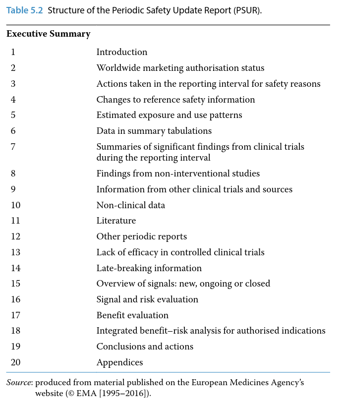
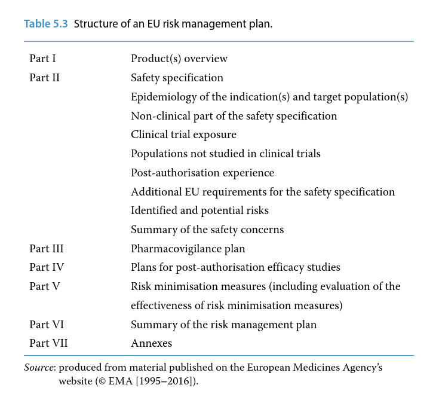
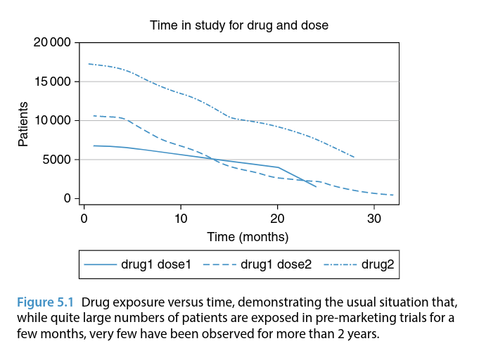

# Regulatory Aspects of Pharmacovigilance

1. [Regulatory Aspects of Pharmacovigilance](#regulatory-aspects-of-pharmacovigilance)
   1. [Legislation and Guidelines](#legislation-and-guidelines)
   2. [Key Elements of European Legislation](#key-elements-of-european-legislation)
   3. [Guidelines](#guidelines)
      1. [Box 5.1 !Box 5.1](#box-51-)
      2. [Table 5.1 !Table 5.1](#table-51-)
   4. [Regulatory Pharmacovigilance Systems](#regulatory-pharmacovigilance-systems)
   5. [Obligations of Pharmaceutical Companies](#obligations-of-pharmaceutical-companies)
   6. [Company Pharmacovigilance Systems](#company-pharmacovigilance-systems)
   7. [ADR Reporting](#adr-reporting)
   8. [Periodic Safety Update Reporting](#periodic-safety-update-reporting)
   9. [Post‐authorisation Safety Studies](#postauthorisation-safety-studies)
   10. [Risk Management Planning](#risk-management-planning)
      1. [Safety Specification](#safety-specification)
         1. [Epidemiology of the Indication(s)](#epidemiology-of-the-indications)
         2. [Extent of Current Clinical Safety Experience](#extent-of-current-clinical-safety-experience)
         3. [Confirmed Adverse Reactions](#confirmed-adverse-reactions)
         4. [Signals of Potential Adverse Reactions](#signals-of-potential-adverse-reactions)
         5. [Areas of Safety Knowledge that are Incomplete](#areas-of-safety-knowledge-that-are-incomplete)
      2. [Pharmacovigilance Plan](#pharmacovigilance-plan)
      3. [Risk Minimisation Plans](#risk-minimisation-plans)
   11. [Conclusions](#conclusions)

The need for medicines regulation and pharmacovigilance became widely recognised in the 1960s as a consequence of the thalidomide tragedy. The role of regulatory authorities worldwide is to protect public health by promoting the safe and effective use of medicines. In general terms, these activities are also in the interests of pharmaceutical companies, but industry has an additional, commercial driver – the needs to recoup investments in products and to satisfy shareholders.

As health and financial drivers sometimes conflict, the authorities have compulsory powers to act on grounds of safety. However, these powers are only used when necessary and most of the time regulatory authorities seek and gain voluntary agreement from companies for the necessary measures.

Legally, both the authorities and manufacturers are responsible for the safety of medicinal products. In the European Union (EU), both parties are obliged to operate pharmacovigilance systems, to exchange data and, where necessary, to take appropriate action to protect patients. The responsibilities of the authorities generally cover all medicinal products – and there are many thousands of them.

Therefore, in practice, they have to focus particularly on issues that are the most important for public health. As the early post‐marketing phase is invariably a period of considerable uncertainty about safety and the time when important new hazards are most likely to be identified, most regulatory pharmacovigilance activity is concentrated on newer drugs.

In this chapter, ‘regulation’ is considered from both sides of the fence: that is, from the perspective of both the regulator and industry. The regulatory obligations of pharmaceutical companies are extensively laid out in legislation and guidelines, but it is important to appreciate that merely meeting these obligations does not ensure the safety of medicinal products. Rather, they should be seen as an essential baseline from which an acceptable safety standard can potentially be achieved. Since the beginning of the twenty‐first century it has been formally recognised that the whole process was previously too passive, that more and better post‐authorisation safety studies are needed, and that proper planning is required if adequate safety knowledge is to be gained. This has led to the introduction of risk management planning to underpin the whole process.

## Legislation and Guidelines

Despite ongoing attempts at international harmonisation (see Chapter 6), legislative requirements for the regulation of medicines continue to differ around the world. Most countries have a medicines regulatory body, which usually operates from within the relevant government department. Pharmaceutical companies are obliged to submit applications to it in territories in which they wish to market their products. In this section, we focus on the EU where, as in many countries around the world, medicines legislation is supported by guidance to give practical advice on how to comply with the law.
Following guidelines is generally a good practice, but it may not always be possible or appropriate. Guidelines are much more easily amended than legislation and tend to increase in size as issues of interpretation are addressed.

## Key Elements of European Legislation

EU medicines legislation has two broad aims: protection of public health and the creation of a single market for pharmaceuticals. EU legislation is initially proposed by the European Commission, goes through extensive consultative and political processes and emerges via the European Parliament to be put into force by the Commission.

In principle, if there is an apparent conflict with any national legislation, EU law takes precedence. However, this does not necessarily mean that national authorities cannot enforce additional requirements in their own territory. A centralised system of authorisation (i.e. one licence valid throughout the EU) was introduced in 1995 and in recent years its use has been obligatory for all new drugs. Many older products have national authorisations in some individual or all Member States. For such medicines, product information may still differ, but when important safety issues arise procedures are available to ensure that harmonised action is taken across the EU.

The legislation defining the centralised system of authorisation is in the form of Regulations, which are directly effective in all Member States. Other relevant EU legislation is contained in Directives, which oblige Member States to implement national laws having specified effects. Until 2010, EU pharmacovigilance legislation occupied short sections within each of the broad legislative documents covering medicines regulation in general:

- Regulation 2309/93, articles 19–26
- Directive 2001/83, Title IX, articles 101–108.

These articles briefly defined the need for both Member States and pharmaceutical companies to operate pharmacovigilance systems and were largely focused on adverse reaction reporting systems.
They were supported by quite extensive guidance which had been developed over many years and was known as Volume 9A.
In 2010, after extensive consultation and development, two major pieces of pharmacovigilance legislation were enacted and came into force in mid‐2012:

- Regulation 2010/1235, and
- Directive 2010/84

which amend the previous Regulation and Directive to introduce substantial new requirements, and greatly increase the volume of pharmacovigilance legislation. There is also an implementing Regulation 520/2012 which covers various practical aspects of the regulatory pharmacovigilance process, for example the contents of key documents such as the pharmacovigilance system master file, risk management plan and periodic safety update report.
The ‘recitals’ at beginning of the main new legislation explain the reasoning behind it and define three broad objectives:

1. Strengthen post‐authorisation regulation of medicines
2. Improve efficiency, both within the pharmaceutical industry and through reduced duplication of effort between the Member States
3. Increase transparency.

To underpin these developments, a Pharmacovigilance Risk Assessment Committee (PRAC) was formed consisting of representatives of Member States, healthcare professionals, patient organisations and independent experts. It meets monthly at the European Medicines Agency (EMA). The pharmacovigilance legislation that came into effect in 2012 also mandated the development of good pharmacovigilance practice (GVP) to replace existing guidance.

When required, regulatory action is taken through the European or national marketing authorisations. The options available are suspension, revocation or variation. These powers are specified in article 116 of Directive 2001/83 (which is not part of the section on pharmacovigilance) and an unfavourable risk–benefit balance (section 117 (c)) provides the most usual basis for compulsory withdrawal from the market. Suspension is temporary and usually put in place as a matter of urgency. Revocation leads to permanent removal of the product and this decision is taken over a longer time scale. In either case, the marketing authorisation (MA) holder is usually given the opportunity to make representations to the authorities. As discussed in Chapter 4, variation of the authorisation is the most common mechanism for dealing with pharmacovigilance issues and, if urgent, there is a mechanism for making safety restrictions within 24 hours. Both the authorities and companies can initiate such restrictions.

Aside from the above legislation, the Regulation covering clinical trials (Regulation 2014/536) is relevant to pharmacovigilance for investigational drugs (i.e. those that are not yet authorised) and Annex 3 specifies the safety reporting requirements.
The most important principles specified in the EU legislation that came into effect in 2012 can be summarised as follows:

- Pharmacovigilance is based largely on existing national systems.
- Member States are responsible for conducting pharmacovigilance in their own territories.
- The EMA is responsible for coordination, and maintenance of
  - (a) the central pharmacovigilance database (EudraVigilance) and
  - (b) a web portal, the purpose of which is to promote transparency in pharmacovigilance by disseminating defined information about medicines authorised in the EU.
- The key advisory forum is the PRAC on whose recommendations the handling of pharmacovigilance issues is based.
- MA holders have defined responsibilities.

## Guidelines

Over the past few years, EU guidance has been extensively changed by the genesis of GVP. As with legislation, there are consultation processes involved in the development of guidelines. At the time of writing, 12 modules of GVP have been developed and published on the EMA’s website (Box 5.1). The titles of these modules are shown in Table 5.1. As well as the general procedural considerations addressed by these guidance documents, a GVP series addressing product or population‐ specific considerations is being developed with chapters relating to (either published or in preparation):

- vaccines
- biologicals
- pregnancy and breast feeding
- children
- the elderly

There is additional pharmacovigilance guidance on the EMA website which is not part of GVP. For example, these cover requirements specific to the centralised system and provide questions and answers in relation to company pharmacovigilance systems. Also relevant to pharmacovigilance are guidelines on the Summary of Product Characteristics (SPC) and Package Leaflet (in Volume 2 of the Rules Governing Medicinal Products), and, for investigational drugs, clinical trial guidelines (Volume 10 of the Rules Governing Medicinal Products, Chapter II). These are part of Eudralex and can be found in the public health section of the European Commission’s website (Box 5.1).

### Box 5.1 

Table 5.1 Good pharmacovigilance practice (GVP) Modules.

### Table 5.1 

## Regulatory Pharmacovigilance Systems

Broadly, there are two functions to pharmacovigilance from the perspective of a regulator: (i) the protection of public health by measures to promote safe and effective use of medicines and prevent serious adverse drug reactions (ADRs), and (ii) regulation of the industry.

Medicines regulatory authorities do not regulate health professionals, who are potentially able to prescribe medicines outside the terms of the authorisation (and unlicensed medicines) on their own responsibility.

In terms of protecting public health, regulators are active at every stage of the pharmacovigilance process described in Chapter 4: in the regulatory environment this means from the time a new medicine starts being studied in humans, through to post‐marketing surveillance, which may continue for many years. In particular, regulators are concerned to ensure that signals are identified as rapidly as possible and are appropriately managed. They also aim to ensure that any actions taken are appropriate, communicated effectively and that their impact is measured.

In terms of regulating industry, the principal issue is one of compliance with the legal requirements. Formal monitoring of industry compliance with pharmacovigilance obligations through inspections is a fairly recent development. These inspections may be undertaken routinely, or at any time if the authorities have a reason to believe there may be non‐compliance. There is a three‐level approach to dealing with non‐compliance. Relatively minor transgressions can be dealt with by educative measures or, in more serious cases, warnings are issued. In very serious or persistent cases, prosecution can be undertaken against the marketing authorisation holder. Offences are determined nationally but include substantial fines and even imprisonment, with both the company and the qualified person (see Company Pharmacovigilance Systems) being held responsible.

It should also be noted that regulators have obligations towards industry, in particular the timely availability to the MA holder of spontaneous ADR reports which they receive from health professionals. This is facilitated through the EudraVigilance database (Box 5.1). They are also obliged to audit their pharmacovigilance systems.

In order to provide the particular focus on new drugs alluded to, in 2013, EU regulators introduced an additional monitoring scheme which was mandated in the legislation. This is primarily for new drugs and usually lasts for 5 years after first authorisation. In order to promote ADR reporting for these products, they are identified by a black triangle symbol in the product information. This is essentially a modification of a scheme that has been in use in the UK since the 1980s.

The EMA publishes on its website lists of products under additional monitoring and, as well as new drugs, the lists include established ones with new safety concerns which are under investigation (e.g. domperidone, see example given later).

## Obligations of Pharmaceutical Companies

Broadly, the pharmacovigilance obligations of companies can be summarised as follows:

- To operate a pharmacovigilance system with documented procedures (known as the pharmacovigilance system master file) and to regularly audit it
- To nominate a qualified person for pharmacovigilance
- ADR reporting
- Periodic safety update reporting
- To inform regulatory authorities of any information that may change the risk–benefit balance of a specific product
- To respond to requests for information from regulatory authorities
- To maintain a system to manage and minimise risk(s) with their medicines
- To keep the product information (including Patient Information Leaflets, PILs) up‐to‐date
- To comply with regulations for marketing and advertising pharmaceutical products.

## Company Pharmacovigilance Systems

The qualified person for pharmacovigilance (QPPV) takes personal responsibility for organisation and management of the pharmacovigilance system within the company. They need to be always available and therefore most large companies also nominate a deputy. It is essential that documented quality procedures are put in place in the form of a pharmacovigilance system master file. Effective pharmacovigilance requires a properly functioning database containing accurate up‐to‐date data. All personnel within the department must be appropriately trained. General system compliance with these principles is now monitored by regulatory authorities through inspections.

## ADR Reporting

We have described the principles of spontaneous ADR reporting in Chapter 3 and how the data are used in the pharmacovigilance process in Chapter 4. Next, we consider the principal activities undertaken by company pharmacovigilance departments: ADR reporting, periodic safety update reporting, post‐authorisation safety studies and risk management planning. It should be self‐evident that the purpose of company ADR reporting obligations is to ensure that regulators have prompt access to reports which are submitted directly to companies.

This led to the concept of the ‘expedited’ report – in essence this is a report of a serious (as defined in Chapter 1) suspected ADR and the obligation is to submit it to the authorities within 15 calendar days of receipt. Non‐serious reports should be submitted within 90 days. In the EU, the use of the Medical Dictionary for Regulatory Affairs (MedDRA) for coding is mandatory and reporting electronically via EudraVigilance is expected to become mandatory for MA holders in 2017.
EudraVigilance is the EU regulatory network’s system for managing information on suspected ADRs reported with authorised medicines, managed by the EMA. It supports safety monitoring by facilitating the electronic exchange of suspected ADR reports among the EMA, national competent authorities, MA holders and sponsors of clinical trials.

The principal use of EudraVigilance is in the early detection and evaluation of possible safety signals for human medicines. It includes an automated message processing mechanism and a large pharmacovigilance database with query, tracking and tracing capabilities.

The EMA publishes data from EudraVigilance as the European database of suspected ADR reports. A public website allows users to view the numbers of serious individual case reports submitted to EudraVigilance for centrally authorised medicines. On their website, the EMA also publishes reports for common drug substances contained in nationally authorised medicines.

There are two further important principles for pharmaceutical companies. The first is that serious (see Glossary) and fatal reports should be followed‐up and the information obtained also reported within 15 days. Companies should also follow‐up incomplete ADR reports and any that represent an event of special interest for the product concerned (e.g. reports of pregnancy for a medicine that is used in women of reproductive age). Secondly, companies should be proactive in searching the medical literature, media (including social media) and the internet to identify potential case reports of ADRs that are not well recognised to occur with their drugs. Assuming they are valid and have been assessed by the company as serious, these should also be submitted within 15 days. A valid individual case safety report meets four criteria:

1. At least one identifiable reporter
2. One single identifiable patient
3. At least one suspected adverse reaction and
4. At least one suspected medicinal product.

Prior to authorisation, in relation to products being investigated in clinical trials, ADR reporting requirements are different. The key principles here are that serious and unexpected (meaning not listed in the Investigator’s Brochure for that specific trial) suspected ADRs (SUSARs) should be expedited, and that such reports should be unblinded for this purpose. Steps should be taken to ensure that personnel directly involved in the trial remain blinded. Companies are required to submit SUSARs both to regulatory authorities and to the ethics committee(s) that approved the trial. They must also ensure that all investigators are kept informed about SUSARs so as to meet the key objective of protecting the safety of trial participants.
The practice of ADR reporting by companies has many complexities which are best learned ‘on the job’ and by applying the available regulatory guidelines. These principles give an overview of current practice and it is the responsibility of industry to keep up‐to‐date with changing guidance and discuss cases of doubt with the relevant regulatory authority.

## Periodic Safety Update Reporting

The concept of, and format for, periodic safety update reporting was developed in the early 1990s by the Council for International Organizations of Medical Sciences (CIOMS) working group (see Chapter 6) and rapidly implemented into legislation in many parts of the world. The objective of producing Periodic Safety Update Reports (PSURs) is to facilitate regular, systematic review of the global safety data available to the manufacturer of marketed products. Over time, the scope of the PSUR has tended to broaden and the overall goal of such review is to identify any change in the benefit–risk profile of the product that might require further investigation or action. Following the adoption of International Council on Harmonisation of Technical Requirements for Pharmaceuticals for Human Use (ICH) guideline E2C (see Chapter 6), PSURs are now also known as Periodic Benefit–Risk Evaluation Reports (PBRERs), reflecting this broadened scope from safety to benefit–risk.

Production of PSURs starts when a drug is first approved for marketing anywhere in the world (international birth date, IBD) and, initially, reports are produced on a 6‐monthly basis. The period covered becomes longer once the drug is established in the market but precise requirements have varied over time and between countries.

In the EU, the new legislation seeks to make the requirements proportionate to the risks. For example, it no longer routinely requires PSURs for generic products containing drugs the safety of which is well established.

The main body of data in each PSUR covers a defined period of time, starting either at the IBD or when data for the previous report were ‘locked’ (i.e. the point at which further information received cannot be included in the report). The contents and structure of a PSUR is summarised in Table 5.2. The ‘reference’ or ‘core’ safety information is also included as an appendix. This is a minimum standard of information which is considered essential for safe use and will be included in all product information worldwide.

Key sections of the PSUR are those that evaluate signals, the integrated risk–benefit evaluation and the overall conclusions and actions proposed. These sections are where any important newly identified or ongoing safety issues are assessed and proposals made to address them.

PSURs are routinely reviewed by regulatory authorities around the world. In the EU, they are submitted in electronic format and the EMA undertakes a single assessment which is reviewed by the PRAC who make recommendations for any action to be taken through the MA. Meeting all the global requirements is complex and resource intensive, despite a fair degree of harmonisation. A format for safety update reporting in relation to investigational drugs in development (Development Safety Update Report, DSUR) has also been proposed by CIOMS (see Chapter 6), and adopted internationally. In the EU, guidance suggests that DSURs should be submitted annually to regulatory authorities.

## Post‐authorisation Safety Studies

Companies started to conduct these studies in the 1980s, but in the early days they were often seen as covert marketing exercises intended to promote use of a new medicine. Of course, it is impossible to study safety in ordinary practice if a drug is little used, but nevertheless it is important that post‐marketing studies have clear safety objectives and do not interfere with prescribing practice. The emergence of databases such as the Clinical Practice Research Datalink in the UK has lessened the need for studies that start by recruiting prescribing doctors and build up a cohort of users (see Chapter 3). From a scientific point of view, single cohort studies based on use of a particular drug have some limitations. They can measure the frequency of a particular event, but they may not provide any indication of the expected or background frequency, leading to judgements about causality being made from the individual cases. This problem is best addressed by including a comparison cohort of patients using an alternative treatment.

A frequent limitation of post‐authorisation safety studies (PASS) is the sample size. Historically, 10 000 patients has often been a fairly arbitrary target for a drug that is likely to be widely used – this is based on the notion that it is about one order of magnitude more than the average number of patients studied in clinical trials. In terms of studying ADRs, which are rare or very rare, this will mean that there are only likely to be a few or possibly no cases observed in the study. In general, such studies will measure events rather than suspected ADRs, but any serious events that are suspected by investigators to be drug-related should be submitted to regulatory authorities as an expedited report.

Companies undertaking PASS will need to submit a draft protocol for review and endorsement by PRAC. They will also need to plan to provide data from the study to the regulatory authorities. The need for undertaking such studies will usually be specified in the risk management plan for the product (see Risk Management Planning). As well as studying ADRs, PASS can provide valuable information about drug utilisation. Who is using a medicine – and how – is an extremely important component of safety.
In recent years, the EMA has overseen the development of the European Network of Centres for Pharmacoepidemiology and Pharmacovigilance (ENCePP). Members of this network are public institutions and contract and research organisations involved in research in pharmacoepidemiology and pharmacovigilance.

Research interests are not restricted to the safety of medicines, but include the benefits and risks of medicines, disease epidemiology and drug utilisation. ENCePP states that its aims are to strengthen the monitoring of the benefit–risk balance of medicinal products in Europe by:

- Facilitating the conduct of high quality, multi‐centre, independent post‐authorisation studies with a focus on observational research.
- Bringing together expertise and resources in pharmacoepidemiology and pharmacovigilance across Europe and providing a platform for collaborations.
- Developing and maintaining methodological standards and governance principles for research in pharmacovigilance and pharma coepidemiology.

ENCePP has produced publicly accessible resources which include a database of available European research resources, a register of post-authorisation studies, a code of conduct which aims to promote transparency and scientific independence and guidance on methodological standards in pharmacoepidemiology.

An example of an important study undertaken through ENCePP is one that was undertaken to assess the rare risk of sudden cardiac death in association with domperidone, a drug widely used for gastrointestinal symptoms such as nausea and vomiting. This case–control study (see Glossary) found an approximately twofold increased relative risk of sudden cardiac death which appeared to be dose‐related.

In 2014, taken in conjunction with other relevant data, the results of this study led PRAC to recommend restrictions on its use, strengthened warnings (particularly in relation to use of interacting drugs) and revocation of the MA for high dose products. In the UK, action was also taken to make the drug a prescription‐only medicine.

## Risk Management Planning

In the past, the pharmacovigilance process often lacked a clear starting point and an active plan to gain further safety knowledge and minimise risks. In recent years, considerable efforts have been made by regulatory authorities and companies to improve existing systems of risk management. It is now recognised that there is a need to focus more on safety, rather than harm, and to actively plan to demonstrate the safety of newly authorised products. An important development introduced into European regulatory processes in 2005 is risk management planning. In the EU, submission of a risk management plan (RMP) is now required with all new applications for MAs (not only all new active substances, but also generic products for example) and for changes to existing authorisations that are likely to significantly extend usage of the product. Plans may also be requested by the authorities at a later stage if an important new safety issue emerges.

The basic structure of an EU RMP, as defined the relevant GVP

The RMP should contain three key sections:

1. Safety specification
2. Pharmacovigilance plan
3. Risk minimisation plan.

The purpose of the safety specification is explicitly to consider the level of safety that has been demonstrated so far. It should identify what is and what is not yet known about safety and the latter (i.e. what is not known) should be a major driver of the pharmacovigilance plan. The purpose of that plan is essentially to attempt to find out what is not yet known, largely because of the limitations of clinical trials.

Table 5.3 Structure of an EU risk management plan.

RMPs should be particularly focused on known or potential risks that cannot simply be managed through routine measures described in the product information.

Until recently, post‐marketing safety activities in pharmaceutical companies mainly concerned satisfying the regulatory requirements outlined earlier in this chapter (i.e. spontaneous reporting and periodic safety update reports). While these are important, they do not in themselves ensure that medicines are safe and often they do little to demonstrate safety. They may also encourage a tendency towards focusing on bureaucratic requirements rather than public health. As it is impossible to know that a medicine is acceptably safe until it has been used in ordinary practice, it is reasonable to argue that demonstrating safety should be a key goal in the post‐marketing period and therefore logical that it is necessary to plan how to achieve it.

### Safety Specification

In the rest of the chapter we consider the key principles on which the key parts of the RMP are based. Any new medicine that has been authorised can be considered to have a level of safety which, in relation to its potential benefits and the disease being treated, is provisionally acceptable. The safety specification section of the RMP
should document the basis of this judgement by considering the five broad areas set out next. The best starting point conceptually is to consider the disease that is to be treated or prevented and the characteristics of the target population.

#### Epidemiology of the Indication(s)

This should include the descriptive epidemiology of the disease indication(s): incidence, prevalence and demographic considerations, prognosis, likely co‐morbidity and co‐prescribing, plus medical events associated with the indication that could be mistaken for ADRs. Such information will be helpful for setting spontaneous ADR reports in context.

#### Extent of Current Clinical Safety Experience

This can be summarised in the form of graphs or tabulations, with calculations of the statistical power to detect ADRs according to duration of treatment and potential latency (i.e. time to onset), based on the following information:

- Overall numbers of patients studied for various durations of treatment and lengths of follow‐up in all pre‐marketing trials.
- Numbers of patients in different sub‐groups, for example, split by age, gender, dose and other characteristics relevant to the disease being treated (presented by duration of treatment and length of follow‐up). Both overall numbers (and sub‐groups where feasible) are best shown graphically using plots of exposure over time (Figure 5.1).

#### Confirmed Adverse Reactions

The main focus here should be on ADRs identified in clinical trials described and quantified by system organ class. Analyses should be based on statistically significant differences seen between treated and control groups. This may be best presented as absolute excess risks with 95% confidence intervals.

#### Signals of Potential Adverse Reactions

These might include the following:

- Serious events that are not statistically significantly different between groups in clinical trials, but that constitute potential signals requiring further evaluation, based on a relative risk of at least 2 or at least one case that was thought to be related to the medicine (either by the investigator or the company following a formal causality assessment).
- Unconfirmed signals of potential toxicity (e.g. potential teratogenicity) found in pre‐clinical data.

#### Areas of Safety Knowledge that are Incomplete

The main areas that are relevant here are:

- Special populations not studied in clinical trials (unless these are to be absolute contraindications to use of the drug), where experience is limited (e.g. children, pregnant women) or for which the safety profile might be expected to be different.
- Rare ADRs not yet observed with the drug, but which are recognised to occur with other drugs in the class, or which are possible based on knowledge of the molecular structure.
- Consideration of the potential for safety concerns based on off‐label use, medication errors and intentional overdose.

### Pharmacovigilance Plan

The marketing of a medicine represents both an opportunity and a need to demonstrate an acceptable level of safety. The pharmacovigilance plan should indicate how this will be achieved in practice, covering both routine pharmacovigilance activities (i.e. those required in legislation for all medicines) and any additional activities that are specific to the product (e.g. PASS). The plan might contain the following types of information:

- Expected levels of use of the product over time (worldwide)
- Strategies to address existing and potential safety signals
- Strategies to monitor recognised serious ADRs to ensure that their incidence is not greater than expected
- Strategies to address areas where safety knowledge is incomplete, for example in special populations
- Proposed milestones at which a greater level of safety experience is expected to have been demonstrated.

Most safety milestones (e.g. PSURs) are based on arbitrary measures of time. When they are reached, safety knowledge may or may not have been extended, in part depending on the level of usage of the product. A conceptually more logical way of defining milestones would be to base them on levels of exposure to the product. They can be derived using the expected level of use, taking into account power calculations indicating the known level of safety at authorisation.

Milestones would then be reached when a specified number of patients had been studied (possibly for a specified length of time) or when particular safety studies are complete.

### Risk Minimisation Plans

RMPs are particularly important when product information alone (i.e.SPC and PIL) is considered to provide insufficient safeguards against known or serious potential hazards. The additional risk minimisation measures that may be contained within them vary from providing general education (e.g. ‘Dear Health Professional’ communications) through specific training of users in safe administration, to restrictions on use‐linked documentation of safe practice (e.g. ensuring that users of clozapine actually have acceptable white cell counts before a further prescription can be dispensed). There may also be additional risk minimisation measures for specific medicines or populations, for example pregnancy prevention programmes for medicines known to be teratogenic and likely to be used by women of childbearing potential (e.g. isotretinoin).

Whatever level of activity is envisioned, good communication is essential and it is important to consider and test the feasibility of the proposed measures. The most common form of activity is promotion of safe use and it is important that this is not confused with mere promotion of use. Regulators generally expect there to be clear daylight between the two activities and are unlikely to accept company representatives as the only vehicle for delivery of risk minimisation measures.

The final step in the process of pharmacovigilance is to assess the extent to which risk minimisation has been successful and if, necessary, to refine or change the measures. This is something that in the past has generally not been performed well, but is now part of the legislation and is receiving much more attention from the authorities.
Potential methods for measuring the success of risk minimisation (see Chapter 4 for further details) include:

- Testing the effectiveness of the communications
- Analysing the effects on prescribing
- Monitoring spontaneously reported cases
- Formal studies of measurable outcomes (e.g. analysing rates of ADRs in defined patient cohorts before and after risk minimization measures).

Simply monitoring spontaneous ADR reports is normally insufficient for the purpose of studying the effects of risk minimisation, but much can be learned from studies of drug utilisation and in particular from studying the characteristics of users and how a medicine is used.

It is relatively easy, for example, to use a prescription database to examine concomitant use of interacting drugs, which might perhaps be contraindicated. Ideally, studies should measure hard and quantifiable outcomes, so that we can learn whether ADRs are being prevented by the measures put in place.

## Conclusions

In this chapter, we have outlined the principles underpinning regulatory pharmacovigilance, focusing on the EU. Legally, both the regulatory authorities and manufacturers are responsible for the safety of medicinal products. Both are obliged to operate pharmacovigilance systems and, where necessary, to take appropriate action to protect patients. Key elements of the process are ADR reporting, periodic safety update reporting, PASS and risk management planning. Much of what we have described in this chapter relating to the EU has been developed through wider international cooperation. How and why this has happened, and the roles of the relevant international bodies is described in the next chapter.
