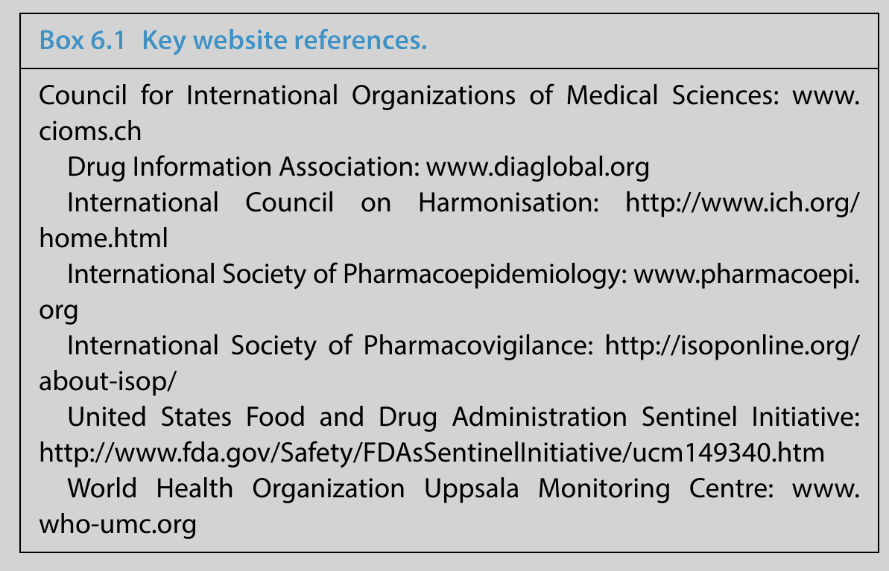

# International Collaboration

Pharmaceuticals are used by patients worldwide so global pharmacovigilance activities are needed to monitor the safety of medicines in all countries where they are marketed. There are many reasons for apparent international variations in the safety of medicines. The population in which a drug is used might be different in terms of ethnicity, demographic factors or the indication(s) for use. The need for a specific medicine and the way in which it might be used may differ (e.g. in terms of dose or monitoring), as might perceptions of risks and benefits in relation to alternative treatments. Despite the legitimacy of all such possible reasons, historical variations in safety recommendations and practice have undoubtedly exceeded what can be explained by them. There are many examples of drugs withdrawn or restricted in one part of the world remaining available in another for no rational reason. Such irrational international variations reflect uncertainty in the relevant data or differing views of experts who advise regulatory authorities on safety. In order to achieve patient safety across the globe - and consistency in practice - it has long been recognised that international harmonisation and cooperation are very important aspects of pharmacovigilance.

International collaboration in pharmacovigilance has advanced greatly in recent years. In medicines regulation, authorities around the world increasingly communicate about global regulatory issues and the pharmaceutical industry has been proactive in requesting international harmonisation for many processes, including adverse drug reaction (ADR) reporting. Non‐governmental international organisations such as the World Health Organization (WHO), the Council for International Organizations of Medical Sciences (CIOMS) and the International Council on Harmonisation (ICH) have continued to develop important pharmacovigilance services and guidelines on practice. Professional bodies - such as the International Society of Pharmacovigilance (ISoP) and the International Society for Pharmacoepidemiology (ISPE) - have become more global. In this chapter we give an overview of the activities and roles of the key international pharmacovigilance organisations and describe how they have developed and collaborated.

## International Regulatory Collaboration

In Chapter 5 we described medicines regulation in the EU, with respect to pharmacovigilance. By developing centralised and harmonised processes, the European Medicines Agency (EMA) has addressed many differences in pharmacovigilance practice which previously existed between different member states - for example, products that had been withdrawn for safety reasons in one country, but not in another. The EMA has also developed centralised databases for ADR reporting, European guidelines on pharmacovigilance practice and expert advisory committees with representatives from all Member States (see Chapter 5). In these ways, the EMA has put international collaboration into active regulatory practice.

Outside Europe, most developed nations - and an increasing number of emerging and low and middle income countries - have their own medicines regulatory body. Countries with authorities covering the highest population size in the WHO Programme for International Drug Monitoring (WHO‐PIDM) include those in Africa (e.g. Nigeria), the Middle East (e.g. Egypt), Asia (e.g. India, China and Japan), Central America (e.g. Mexico), South America (e.g. Brazil) and the Russian Federation. In most countries, pharmacovigilance activities are conducted by the national regulatory authority, which usually sits within the government’s health department. However, there are notable exceptions, including in Japan, Korea, the Netherlands and New Zealand, where the pharmacovigilance centre lies outside the government regulatory body, collecting and providing data for the national authority.

The US Food and Drug Administration (FDA) is the oldest regulatory authority in the world. The FDA was established in 1906 and their remit has always included monitoring the safety of medicines and food products. This remains a key difference between the FDA and some other national regulatory authorities, including the UK Medicines and Healthcare products Regulatory Agency (MHRA), which does not cover food (this is monitored by another UK government agency). However, many other national regulatory authorities (including several Asian authorities; for example, China FDA, Thai FDA, Philippines FDA) regulate food products in addition to drugs.

The US FDA covers vaccines, blood products, medical devices, tobacco products, cosmetics and veterinary products, and so has a very wide scope.

By 2010, the US FDA employed nearly 15 000 people and in 2012 its annual budget was over $4 billion. The size and resources of the US FDA enabled it to lead the way in medicines regulation worldwide for many years, especially licensing of new medicines. Today, most other countries have their own regulatory authority but many countries still follow guidance developed in Europe (see Chapter 5) or the USA. Regarding pharmacovigilance, the FDA’s primary tool is its spontaneous reporting programme, MedWatch, which was established in 1993. In more recent years, the FDA’s requirements for post-marketing risk management have been increasing, as in Europe (see Chapter 5). In 2007, US legislation was amended, mainly as a consequence of concerns about rofecoxib (see Chapter 1) and the following year the FDA launched the Sentinel Initiative, a proactive electronic system for post‐marketing surveillance.

In 2014, the UK MHRA and US FDA led discussions to establish a global regulatory authority which resulted in the formation of the International Coalition of Medicines Regulatory Authorities (ICMRA). The purpose of this voluntary organisation is to allow the heads of national regulatory authorities around the world to develop shared strategic leadership in order to address current and emerging global regulatory challenges, including safety issues. An example of this is that the ICMRA collaborated with the WHO in 2015 to help deal with the Ebola virus outbreak which affected many countries.

The ICMRA has set up several working groups to examine issues such as rapid sharing of information and generic medicines.

## World Health Organization

The WHO’s international collaborative programme on drug safety was originally set up in 1968 and since 1978 the Uppsala Monitoring Centre (UMC) in Sweden has provided scientific leadership and technical support to this expanding worldwide pharmacovigilance network.

The WHO programme began with only a handful of participating countries but, by 2016, the number of countries included had risen to 153 (124 full members and 29 associate members). Some national centres with particular pharmacovigilance expertise have become WHO Collaborating Centres. More recently established Collaborating Centres include Ghana (2009), Morocco (2012) and Lareb in the Netherlands, which provides additional expertise in the areas of patient reporting and pharmacovigilance curriculum development.

The main WHO‐UMC programme activities of today are as follows:

1. Programme for International Drug Monitoring (PIDM) All countries that are members of the WHO‐PIDM provide their post-marketing individual case safety reports to the UMC, where the data are entered into the global reference source, VigiBase. By December 2015, there were over 12 million reports in VigiBase, accessible to all national pharmacovigilance centres through UMC’s web‐based search and analysis tool, VigiLyze. Data requests can also be made by anyone with a legitimate interest in the reports contained in VigiBase, although charges may be levied on those outside national centres.
2. Training and support for participating countries The UMC and its Collaborating Centres offer training and support to any country wishing to set up and develop a national pharmacovigilance centre. Examples of newly established centres since 2000 include Sri Lanka (2000), Ghana (2001), Peru (2002), Sudan (2008), Jamaica (2012) and Swaziland (2015); a full list can be found on the UMC website (Box 6.1). Many countries - especially developing nations - start with little resource, few staff and a low number of reports submitted, but once in the WHO programme many develop into larger and more productive centres. In addition to on‐the‐ground support, regular training and education sessions are provided to WHO programme members, and there is also an annual WHO National Centres meeting which is held at different locations around the world. Some of these annual meetings are timed to run back‐to‐back with the annual ISoP conference, with joint sessions on an overlapping day to encourage greater international collaboration.
3. Providing products and commercial services More than 70 WHO programme members use the web‐based data management system, VigiFlow, developed by the UMC. Commercial services offered by the UMC include the WHO Drug Dictionary Enhanced, which is offered mainly to industry and research organisations. The UMC no longer provides subscriptions to the WHO Adverse Reaction Terminology (WHO‐ART), but continues to provide the WHO‐ART to MedDRA Bridge, which is intended to help countries migrate to MedDRA (see Glossary).
4. Pharmacovigilance analysis and research For signal detection and investigation, the UMC uses a data‐mining approach (see Chapter 4) supported by additional triage algorithms, and clinical assessment provided by UMC experts and a panel of reviewers. The UMC’s research department undertakes methodology research, including data mining of electronic healthcare records and structured benefit-risk assessment.
5. Communicating drug safety information worldwide Information is exchanged within the WHO programme network through the publication of the WHO Pharmaceuticals Newsletter, and electronically through the VigiMed collaboration portal. The UMC distributes the Signal document, containing summaries of signals recently investigated, and publishes Uppsala Reports, a magazine giving information on current pharmacovigilance topics and news from centres around the world.

## Council for International Organizations of Medical Sciences

The CIOMS is an international, non‐profit, non‐governmental organisation established jointly by the WHO and United Nations Educational, Scientific and Cultural Organization (UNESCO) in 1949.

It has served as a forum for discussions between regulators and industry on a variety of pharmacovigilance topics since the late 1980s and reports from CIOMS working groups have been highly influential in shaping legislation and guidelines around the world. In 2013, membership of the CIOMS included 49 international and associate member organisations.
The activities of CIOMS can be broadly divided into three areas:

1. Drug development research
2. Human ethics, particularly in medical research
3. Working groups to produce guidance on drug safety issues.

Here, we focus on the CIOMS working groups as these have the most direct relevance to pharmacovigilance. Between 1990 and 2015 10 formal CIOMS working groups have been established, the topics and broad vision of each are summarised next.

### CIOMS I: International Reporting of ADRs (1990)

Before the mid‐1980s, reporting requirements to regulatory authorities related almost entirely to ADR reports occurring on each national territory. Some countries then started to introduce requirements for submission of ‘foreign’ reports. This working group was convened to discuss the principles of what should be reported and how. The key output was that ‘foreign’ reports should be of suspected reactions which were both serious and unexpected (i.e. unlabelled) and should be submitted within 15 days.

This CIOMS group also developed a reporting form - the ‘CIOMS
form’ - which became the international standard. In 1995, the working group reconvened (as CIOMS Ia) and made proposals for the data elements to be included in electronic transmission of reports. Today, this form, known as the CIOMS 1 form, is still used for ADR reporting, although the current international standard for reporting is now the ICH E2B format, which was developed based on the data elements described in CIOMS Ia.

### CIOMS II: International Reporting of Periodic Safety Update Summaries (1992)

This report made the original proposals for the format and content of Periodic Safety Update Reports (PSURs). Since 1992, requirements for PSURs have been widely implemented as a regulatory requirement and there is now a European GVP Module covering this subject (see Chapter 5). A harmonised guideline has also been adopted through the ICH.

### CIOMS III: Guidelines for Preparing Core Clinical‐Safety Information on Drugs (1995)

The third CIOMS report addressed the problem of variations in safety labelling around the world by proposing that manufacturers should develop ‘core clinical‐safety information’ which contains all the relevant safety information that needs to be included in all countries where the drug is marketed. This is effectively a minimum standard - additional information may be included in some countries and it also serves as the basis for deciding whether a specific adverse reaction is ‘listed’ (i.e. expected).

### CIOMS IV: Benefit-Risk Balance for Marketed Drugs - Evaluating Safety Signals (1998)

This report proposed a standard format and content for a benefit-risk evaluation report and also laid down the principles for good decision-making practices. The CIOMS IV working group recommended a harmonised approach to the analysis, reporting and decision‐making steps involved in any re‐evaluation of benefit-risk that is required when safety issues arise.

### CIOMS V: Current Challenges in Pharmacovigilance - Pragmatic Approaches (2001)

CIOMS V covered good case management and reporting practices, both in terms of individual cases and summaries. It included specific recommendations and was intended to be used as a handbook in pharmacovigilance departments. A general recommendation was that the ultimate goal should be a single, global, shared dataset.

### CIOMS VI: Management of Safety Information from Clinical Trials (2005)

The aim of this report was to enhance awareness of the ethical and technical issues associated with safety in clinical trials. The working group proposed a systematic approach to managing safety during clinical development. The CIOMS VI report was wide ranging, covering ethical issues, statistical approaches to identifying risks and communication of safety information from clinical trials.

### CIOMS VII: The Development Safety Update Report - Harmonising the Format and Content for Periodic Safety Reporting During Clinical Trials (2006)

This report proposed the content and format for a Development Safety Update Report (DSUR), a means of regular and timely review, appraisal and communication of safety information during the clinical development of drugs. The working group suggested that the DSUR and PSUR could be integrated into a single harmonised safety report that would cover a product throughout its life cycle.

### CIOMS VIII: Practical Aspects of Signal Detection in Pharmacovigilance (2010)

This working group looked at how electronic capture of data was resulting in the accrual of large datasets with much potential for complex analyses. The CIOMS VIII report gave practical recommendations for how such datasets could be managed for signal detection and how pharmacovigilance systems and practices could be strengthened.

### CIOMS IX: Practical Approaches to Risk Minimisation for Medicinal Products (2014)

The CIOMS Working Group IX was set up in 2010 to develop a pragmatic consensus publication that would contain a harmonised list of tools for managing the risks of medicinal products, as well as considerations governing the potential application of these tools. Following review, drafting and wider consultation, the group’s report was published in 2014.

### CIOMS X: Meta‐analysis

The 10th CIOMS working group was set up to consider how good meta‐analysis practices could be applied to clinical safety data within the biopharmaceutical regulatory process. Meta‐analyses (see Chapter 3) have been increasingly used to examine risks and benefits of medicines and there is continuing debate as to the value of this approach. The report from this working group was expected to be published during 2016.

### Other Activities of CIOMS

In addition to the projects discussed, CIOMS working groups have also addressed the following issues:

- Vaccine pharmacovigilance
- Pharmacogenetics
- Drug development research and pharmacovigilance in resource-poor countries.

CIOMS has also been involved in developing definitions of ADR terms and, in particular, definitions for the frequencies at which ADRs are reported to occur (see Chapter 4).

## International Council on Harmonisation

Formerly known as the International Conference on Harmonisation, which was established in 1990, the organisation was renamed the International Council for Harmonisation of Technical Requirements for Pharmaceuticals for Human Use (ICH) in 2015. The aim of the ICH is to bring together regulatory authorities and the pharmaceutical industry to discuss scientific and technical aspects of drug registration. It is a more formal group than CIOMS, which is more an ideas ‘think tank’ which produces reports, and has a wider remit for harmonisation across the drug development process.

The ICH has also been influential in shaping current regulatory requirements relating to pharmacovigilance, particularly through its guidance documents. It was previously tripartite in terms of regions, covering the EU, the USA/Canada and Japan, but is now open to any country fulfilling the requirements set out in the ICH Articles of Association. In addition to representatives from regulation and industry, there are various observers including the WHO and International Federation of Pharmaceutical Manufacturers and Associations. The main purpose is to harmonise existing guidelines related to development and registration of medicines

ICH guidelines have a five‐step development process:

- Step 1 - Preliminary discussion by relevant experts and production of a draft
- Step 2 - The draft is considered and signed‐off by the Management Committee
- Step 3 - Wider consultation and revision
- Step 4 - Final sign-off by the Management Committee
- Step 5 - Implementation into the relevant legislation and guidelines.

In principle, the authorities in each territory are committed to implementing ICH guidelines, although in practice the timing and extent of implementation have been variable.

There are four broad categories of ICH guideline:

1. Quality - for example, guidelines on the conduct of stability studies.
2. Safety - covering pre‐clinical risks such as genotoxicity, reproductive toxicity and carcinogenicity. A notable ICH safety guideline examined non‐clinical testing to assess the risk of QT prolongation with certain medicines.
3. Efficacy - these guidelines cover the design, conduct, safety (note that ICH includes pharmacovigilance in the ‘Efficacy’ guidelines group) and reporting of clinical trials.
4. Multi‐disciplinary - these cover topics that do not fit neatly into any of the above three categories - for example, the ICH medical terminology (MedDRA), the Common Technical Document (CTD) and the development of Electronic Standards for the Transfer of Regulatory Information (ESTRI).

In relation to pharmacovigilance, the key ICH guidelines are E2A‐E2F (included in the Efficacy group above) and the dates at which they were implemented were as follows:

- E2A: Definitions and Standards for Expedited Reporting (1994)
- E2B: Data Elements for Electronic transmission of Individual Case Safety Reports (1997)
- E2C: Periodic Safety Update Reports for Marketed Drugs (1996)
- E2D: Post‐approval Safety Data Management (2003)
- E2E: Pharmacovigilance Planning (2005)
- E2F: Development Safety Update Report (2010).

ICH guideline E2E had a significant international impact, its key message being that additional methods to spontaneous reporting are required to monitor the safety of medicines adequately in the post-marketing period. In the years that followed publication of E2E, the US FDA developed the Sentinel Initiative for additional monitoring of medicines and the EU worked towards introducing more regulatory requirements for risk management planning (see Chapter 5).

## International Scientific Collaboration

Earlier chapters of this book discuss basic methods and tools for pharmacovigilance (see Chapter 2) and the types and sources of data that are used in the scientific investigation of drug safety issues (see Chapter 3). It is worth noting here that the science and methodology of pharmacovigilance has developed substantially in recent years, and that much of this has been a result of international collaborative efforts. In addition to the work carried out by regulatory bodies and the international organisations, a significant amount of pharmacovigilance and pharmacoepidemiology research has been performed by academic institutions around the world. Many studies have been international multi‐centre studies, especially investigations of less common outcomes, where large numbers of patients need to be included to obtain meaningful results. Researchers, academics and clinicians worldwide have collaborated with national pharmacovigilance centres, WHO collaborating centres and other non‐governmental organisations to develop scientifically robust methods for the practice of pharmacovigilance (see Chapter 4).

## International Professional Societies

Much international collaboration in pharmacovigilance occurs through professional societies which support their members in encouraging sharing of information and ideas and promoting research.

Collegial networking in these societies is valued by those working in the different areas where pharmacovigilance is practiced (e.g. regulation, industry, academia/research, clinical work) and over many years has resulted in numerous professional collaborations.There are several professional bodies for people working in pharmacovigilance and some are based on the members’ qualifications (e.g.pharmacists’ associations in different countries) or their employment role (e.g. the Regulatory Affairs Professionals Society). There are three broader international professional societies, which do not require specific qualifications or employment roles for membership, as follows.

### International Society of Pharmacovigilance (ISoP)

IsoP began in 1993 as the European Society of Pharmacovigilance (ESoP) and for the first few years activities and meetings were mainly for those working in Europe. However, in 2001, ESoP became ISoP and there has since been a strong focus on increasing the international reach of the society. There are now several regional chapters of ISoP including the Western Pacific, Latin American, Middle Eastern and African chapters, in addition to several European chapters.

ISoP organises an annual research‐based conference (held alternate years in Europe and outside Europe) and also offers training courses for members throughout the year. Abstracts from ISoP conferences are published in the international journal Drug Safety. ISoP also runs several special interest groups (SIGs) including Risk Communication and Women’s Medicines. It describes itself as a society that is ‘professional, independent, non‐profit and open to anyone with an interest in the safety and effectiveness of medicines’.

### International Society for Pharmacoepidemiology (ISPE)

ISPE began in 1989 as a North American and European society and includes those working in the broader field of pharmacoepidemiology in addition to pharmacovigilance. Like ISoP, ISPE has become more international in recent years and has regional chapters. It also now holds an annual pharmacoepidemiology conference in Asia, in addition to its other meetings. Abstracts from ISPE meetings are published in the international journal Pharmacoepidemiology and Drug Safety.

ISPE also has several SIGs, including those covering drug utilisation research, medical devices and vaccines. It is a larger society than ISoP and there is some collaboration and networking between the two societies. Both ISoP and ISPE have links with CIOMS and ICH, and many working in pharmacovigilance worldwide are members of more than one group.

### Drug Information Association

The Drug Information Association (DIA) was founded in 1964 as a ‘neutral global membership association’ which aimed to provide a forum for all those working in healthcare product development ( especially in industry and regulation) to discuss pertinent issues. Its goals of communication and collaboration in the area of drug development remain the same and issues relating to safety of medicines and benefit assessment still fall under the DIA umbrella. However, members of DIA are more likely to be those working in pre‐licensing drug development, rather than post‐marketing pharmacovigilance and pharmacoepidemiology.

## Conclusions

Pharmacovigilance is an international activity and collaboration and communication are needed more than ever before to monitor the safety of products marketed worldwide. Much pharmacovigilance and pharmacoepidemiology research and monitoring is conducted all around the world. While the USA and Europe continue to play a major part in regulation, research and development, other countries outside these regions have much to contribute in the area of post‐marketing surveillance.

There is a continuing need for practical pharmacovigilance in all countries where medicines are marketed, and the WHO worldwide pharmacovigilance programme includes over 150 countries. Other international bodies, including the CIOMS and ICH, have made significant contributions to pharmacovigilance guidance and continue to provide forums for international discussions. Three international professional societies - ISoP, ISPE and the DIA - also provide members with opportunities for communication, discussion of research and collaboration across the world.
