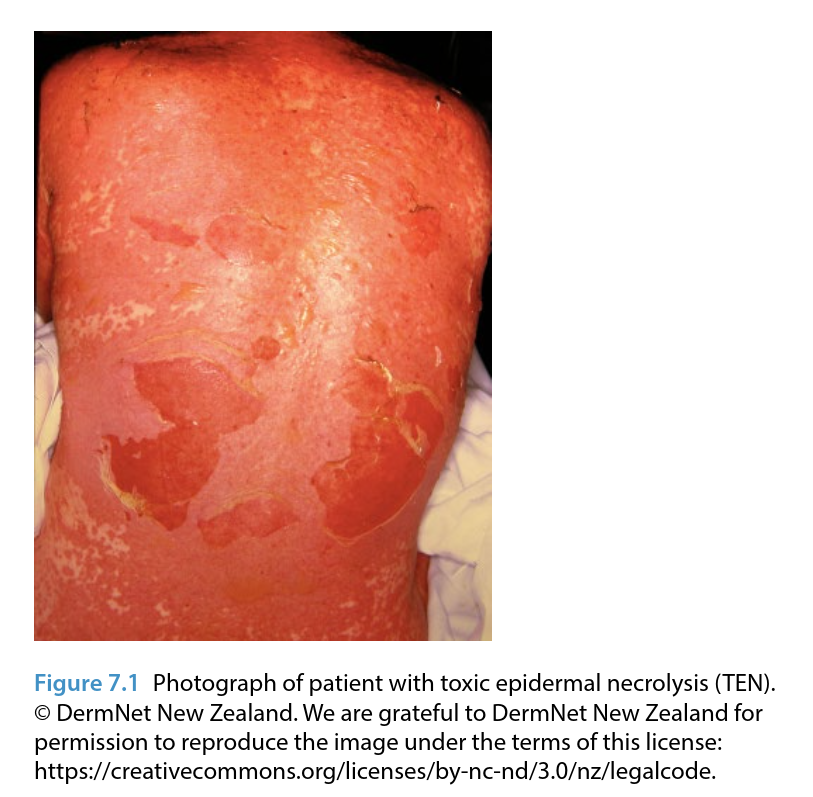

# Clinical Aspects of Adverse Drug Reactions

In clinical practice, prescription of a medicine is the most common intervention. Prescribing rates have increased in many countries in recent years: in England, the number of prescriptions dispensed increased between 2006 and 2013 from approximately 15 to 19 per person per year. In 2013, over 1 billion items were prescribed in England alone, costing £8.63 billion during that year. The monetary costs of prescribing such large numbers of medicines are only one aspect of the impact of this frequent clinical intervention. Equally significant are the consequences for patient safety. A report by the American Institute of Medicine, ‘To Err is Human’, identified adverse drug reactions (ADRs) as the most common clinical adverse event. In the UK, which has a population of around 60 million, the total number of spontaneously reported ADRs has increased in recent years. In 2015, a total of 39 046 reports were received by the MHRA compared to 21 419 in 2006. In everyday practice, side effects to medicines result in high mortality and morbidity rates and cause much clinical burden.

Pharmacovigilance has its roots in clinical practice - this is where the majority of ADR reports originate - and the most important aim of all pharmacovigilance activities should be to improve patient safety in every clinical setting. People take medicines in a wide variety of environments, most often in the community where they live, but also in hospitals and other care facilities, in schools, residential homes and prisons. Others volunteer to take medicines as part of a clinical trial or research study, either as healthy participants or for a specific condition. It is important to understand the clinical context in which medicines are used and how medicines have many benefits. Some treatments have completely changed the prognosis or quality of life for patients; for example, statins for the primary and secondary prevention of cardiovascular disease and isotretinoin for the treatment of severe acne. However, all medicines have side effects and in earlier chapters we have discussed benefit-risk evaluation in the processes and practice of pharmacovigilance. Nowhere is this assessment more important than in the clinical setting, where health professionals need to communicate the potential benefits and harms of medicines directly to patients and their caregivers.

In this chapter we give an overview of the clinical aspects of adverse drug events and some examples of important ADRs encountered in medical practice. We then consider some specific patient populations and discuss how patient safety could be improved in the clinical environment.

## Clinical Burden of ADRs

ADRs are an important cause of morbidity and mortality in many clinical settings and continue to place a major demand on public health services worldwide. In 2004, a British study reported that 6.5%
of hospital admissions were directly a result of an ADR, with a projected annual cost to the National Health Service of £466 million.

A systematic review which included 25 observational studies (with a total of more than 100 000 patients) reported that about 5% of hospital admissions were associated with an adverse drug event. Thus, the burden of ADRs on hospital systems - and the associated costs - is significant.

Data on the prevalence of ADRs in patients in the community are more difficult to find. A prospective cohort study of over 1200 patients attending four primary care practices in Boston, USA, found that about one‐quarter of people who responded to the survey experienced an adverse drug event and about 13% of all events identified were classified as serious. The effects of ADRs on patients (and healthcare professionals and systems) in general practice can be wide-reaching. In addition to the mortality and morbidity directly caused by ADRs, there may be indirect clinical effects; for example, issues affecting medication adherence. A patient experiencing clinically significant adverse events related to a medicine (e.g. gastro‐intestinal
effects caused by metformin prescribed for diabetes) may be less compliant and even stop taking the medicine completely. In the example of a patient prescribed metformin this may lead to poor blood glucose control and worsening diabetes, with more clinical consequences.

ADRs are an important form of iatrogenic (i.e. doctor‐induced) disease. Many of the serious reactions that occur are well‐recognised and potentially preventable; for example, bleeding with warfarin, or the upper gastro‐intestinal effects of non‐steroidal anti‐inflammatory drugs (NSAIDs). In public health terms, it is not newly introduced drugs that are responsible for most of the population effects of adverse drugs reactions, but those whose safety profile is ‘well‐established’.

The burden of ADRs on people’s lives can extend far outside the clinical environments in which they are treated. There are many less measurable impacts of illness; for example, dependency on family or other carers, lost working hours (and hence financial cost), time away from education or training opportunities and reduced quality of life.

For older patients - a group at high risk of ADRs - the last point is especially important. It could be argued that there is little point prescribing medicines to extend the number of years of life if those years are of such poor quality that they cannot be enjoyed.

## Important ADRs and Minimising Risk

The most important ADRs in clinical practice are those that cause serious morbidity and mortality - that is, those that are potentially life‐threatening. There are many examples of such ADRs - from general anaphylaxis to serious adverse events affecting any body system.

It is beyond the scope of this book to describe them all and so instead we have chosen some examples of important ADRs and discuss how the risks of these serious events can be minimised in clinical practice.

### Gastro‐intestinal Bleeding

Bleeding from the gastro‐intestinal tract is a recognised side effect of some of the most commonly prescribed medicines, including NSAIDs, selective serotonin re‐uptake inhibitors (SSRIs), warfarin and the newer novel oral anticoagulants (NOACs), alendronate and other bisphosphonate medicines, and corticosteroids such as prednisolone (or prednisone in the USA and Oceania). Long‐term users of NSAIDs (e.g. patients with arthritis, other inflammatory conditions or chronic pain) have a 1-4% annual risk of gastro‐intestinal bleeding and it has been estimated in the UK that this causes 12 000 emergency admissions and 2200 deaths per year.

Gastro‐intestinal bleeding can occur from any region of the tract - from the mouth, teeth and gums down to the rectum and anus - and may range from relatively minor, to major life‐threatening haemorrhage. Commonly affected areas are the stomach and small intestine, where gastro‐intestinal bleeding may present as haematemesis (vomiting blood). Gastro‐intestinal haemorrhage may also present as melaena (dark stools) or rectal bleeding. Patients most at risk include the elderly, those taking anticoagulants, patients with pre‐existing disorders of coagulation and those on multiple medicines, especially other medicines known to cause gastro‐intestinal bleeding.

The pharmaceutical industry has attempted to reduce the risk of gastro‐intestinal bleeding associated with many medicines by developing new products; for example, enteric‐coated NSAIDs, more selective cyclo‐oxygenase 2 (COX‐2) inhibitors and combination products (e.g. tablets containing a NSAID and a prostaglandin), and some of these have been successful. Other ways of minimising the risk of drug‐related gastro‐intestinal bleeding in clinical practice include the following:

- Identifying patients at high risk by taking a thorough family history, reviewing all clinical details for each patient including a full medication history, including herbals and other over‐the‐counter (OTC) medicines such as aspirin, and alcohol intake.
- Reducing drug use in high‐risk patients, for example older people.
- Prescribing the lowest possible dose for the shortest possible time period.
- Prescribing the medicine with the lowest risk; for example, ibuprofen as the NSAID with the lowest risk of gastro‐intestinal bleeding.
- Consider co‐prescribing acid secretion blocking medicines.
- Informing patients of the risk of gastro‐intestinal bleeding and encouraging them to present early to medical services if such side effects occur (this is important for reducing fatalities).

### Agranulocytosis and Other Blood Dyscrasias

Some medicines have adverse effects on blood cells, including granulocytes (white blood cells) which are a vital component of the immune system. An example of a medicine that can affect the number of neutrophils (the most common type of granulocyte) is clozapine, an atypical antipsychotic prescribed for treatment‐resistant schizophrenia. Clozapine has an important place in clinical practice as it is very effective in some patients who do not respond to other antipsychotic medicines, or who have specific symptoms which are difficult to control with other medicines. It has been reported that approximately 30-60% of patients with schizophrenia resistant to other treatments will respond to clozapine.

While clozapine is clinically effective in a group of patients who have limited other options, it is also associated with serious side effects including myocarditis (inflammation of the heart muscle), gastro‐intestinal dysmotility (causing severe constipation in some patients) and serious haematological effects. The frequency of neutro-penia (defined in most countries as a neutrophil count of less than 1.5 × 109/L) in clozapine‐treated patients is 2% and of agranulocytosis (defined as a neutrophil count of less than 0.5 × 109/L) is 0.8%.
Agranulocytosis may be life‐threatening, or even fatal, as the patient’s immune system is severely compromised.

For some medicines, identification of such a serious ADR - with associated deaths reported -have resulted in permanent withdrawal from the market if the risks were thought to outweigh the benefits of treatment. However, the importance of clozapine in clinical practice was recognised and pharmaceutical companies - working in collaboration with clinicians, researchers and regulators - developed a risk-minimisation solution which allowed clozapine to be authorised for schizophrenia resistant to other treatments. In several countries, clozapine manufacturers have developed mandatory monitoring programmes in which patients’ blood samples are regularly tested to detect haematological adverse effects.

In clinical practice, clozapine is started by the patient’s psychiatrist and should only be prescribed if the patient has not responded to other antipsychotic medications. Blood tests are performed before clozapine is started (a normal white cell count is required) and then at least weekly for the first 18 weeks of treatment. After that time, blood tests are required at 2‐week intervals during the first year and then at 4‐week intervals for the remainder of the time on treatment (and also for 4 weeks after stopping treatment). Pharmacists have an important role in clozapine risk management programmes, as they check that blood tests have been performed before dispensing the patient’s next dose of clozapine. Some schemes have a ‘red, amber, green’ approach to guide prescribers and pharmacists, with a ‘red’ result indicating that clozapine should not be prescribed if white cell counts have fallen too low. Community psychiatric nurses also play an important part in supporting patients on clozapine.

## Common Clinical Scenarios

These examples outline how potentially serious ADRs can be managed effectively in clinical practice and how life‐threatening outcomes can be prevented, but there are many other examples in everyday practice where management of patients is not as clear‐cut. In Box 7.1 we describe a common clinical case scenario involving management of a patient concerned about side effects from statins.

This case reveals some of the complexities of identifying and managing ADRs in real‐life clinical practice. Muscle aches and worsening memory are both common complaints in older patients and there may be other factors (e.g. increased physical activity) that may be responsible for the onset of new symptoms. It is also possible that new symptoms represent new‐onset disease (e.g. polymyalgia rheumatica or polymyositis) rather than an ADR. Physical examination and blood tests help the doctor exclude or confirm certain conditions, but as seen in the case history, often there is not a specific blood test for a particular symptom or ADR and results can be equivocal rather than giving an exact diagnosis. In this case, the positive dechallenge and rechallenge suggested that the patient’s muscle symptoms were likely caused by the first statin, but in practice it is not always easy to get such evidence - for example, if a patient is unwilling to restart a medicine that caused them to have unpleasant symptoms. Finally, in the case in Box 7.1, changing to another statin helped the patient’s muscle symptoms (while theoretically myalgia is a class effect of statins, in practice many patients find they do not get symptoms with another medicine of the same class) but did not give as effective control of her blood lipids. This shows that in real life, often a compromise position has to be reached.

Box 7.1 Case history.

Mrs X, a 61‐year‐old woman, visits her GP for a review of her statin medication and a repeat prescription. A year earlier, she had been invited to have a cardiovascular risk assessment with the practice nurse and was found to have hyperlipidaemia (increased levels of fats in the blood) which gave her an elevated cardiovascular risk score. She was advised to make dietary changes, but these did not significantly alter her cholesterol ratio, so Mrs X was commenced on a statin medication (HMG‐CoA reductase inhibitor).

At her medication review, Mrs X mentions to her GP that she has read on the internet about ‘muscle problems’ and memory loss with statins. She feels her memory has deteriorated in the past year and that she has been experiencing more general aches and pains. Mrs X asks her GP if these symptoms could be caused by the statin. On further discussion, she also reports that she has recently retired, has been redecorating her house and has been much more active in her garden.

Her GP checks that she is not on any other concomitant medications, including herbal treatments and over‐the‐counter products.
The GP examines Mrs X and finds no evidence of muscle tenderness or weakness. Blood tests are performed for creatine kinase (an enzyme marker of muscle breakdown) and serum cholesterol. A few days later Mrs X is told her tests show her cholesterol levels are under good control on the present dosage of statin. Although her creatine kinase is slightly raised, it is not enough to indicate rhabdomyolysis (muscle breakdown) or myositis (muscle inflammation). Mrs X is still concerned about her symptoms and so it is agreed that she will stop the statin for 2 weeks (dechallenge) to see if her symptoms improve and then restart the medicine at the same dose (rechallenge).

After stopping the statin, Mrs X notices a marked improvement in her muscle pains, but no change in her memory. On restarting the medicine, her muscle pain returns (positive rechallenge) so her GP advises trying a lower dose. Mrs X reduces the dosage but still experiences muscle symptoms and after further discussion her GP switches her to another statin. She tolerates this drug without muscle side effects, but her blood lipids are not as well controlled as with the first statin. Mrs X is unwilling to try a higher dosage of the new statin, so it is agreed she will remain on this dosage and accept the risks of less tightly controlled hyperlipidaemia.

Other common clinical scenarios are less complicated - for example, a patient who presents with a drug rash, which is easily identified through taking a clear history and clinical examination. Skin ADRs are among the most commonly reported group of reactions reported to regulatory authorities and fall into several groups:

- Erythematous (redness), maculo‐papular (flat and raised redness) or exanthematous (blotchy redness)
- Urticarial (sometimes known as hives or nettle rash)
- Angioedema (swelling of the face, lips, oral cavity and upper respiratory tract)
- Photosensitivity (skin reaction to sunlight)
- Purpuric (bruising or bleeding under the skin)
- Fixed drug eruption (recurrence at same site)
- Bullous (blistering) conditions (e.g. bullous pemphigoid or sub-epidermal blistering)
- Widespread skin reactions (e.g. Stevens-Johnson syndrome, SJS; toxic epidermal necrolysis, TEN).

Most skin ADRs are not serious and resolve on cessation of the medicine and symptomatic treatment, but some require biopsy by a specialist. However, some skin reactions are very serious - for example, SJS or TEN (Figure 7.1) - and can affect the whole body. Such reactions are life‐threatening and require intensive treatment, despite which they are sometimes fatal.

## Important Patient Populations

While it is important to remember that any patient can experience an ADR to any medicine at any time (not all ADRs occur in the first days or weeks of treatment), some patients are at higher risk of ADRs:

- Women - in every age group, women take more medicines than men (including contraceptive products, herbals and OTC medicines), may metabolise medicines differently and experience more ADRs. In the UK, in 2015, more spontaneous ADR reports were received for women (56%) than men (39%), with gender unspecified in some cases.
- Older patients - the elderly are prescribed more medicines than younger patients, take medicines for longer periods, have more pre‐existing disease (including deteriorating hepatic and renal function) giving more chance of ADRs and drug interactions. Recent UK data show that the age band with the highest number of spontaneous ADR reports per year was 61-70 years (note that these are absolute numbers of reports and not frequencies of ADRs).
- Patients with chronic (long‐term) conditions - examples include those with diabetes, autoimmune conditions, epilepsy, arthritis or other joint conditions, schizophrenia and other chronic psychoses, hypertension, heart disease, and chronic lung disease. These patients are likely to be on long‐term medications, may be taking several medicines and there may also be aspects of their conditions that make them more susceptible to ADRs.
- Patients with genetic or other susceptibilities affecting how medicines are metabolised - for example glucose‐6‐phospate dehydrogenate deficiency (an X‐linked recessive enzyme deficiency which affects about 400 million people worldwide) which alters metabolism of several medicines including antibiotics and antimalarials. In addition to the above groups, there are special populations where exposure to medicines should be carefully considered, as follows.

### Pregnant Women

Virtually all medicines cross the placenta, resulting in fetal exposure, so it is important for clinicians and women to consider this risk, especially as many pregnancies are unplanned. However, it is also important to remember that some women require medicines during pregnancy, for example those with epilepsy or other chronic conditions. The benefit-risk assessment of medicines in pregnancy may be quite complex and it advisable to refer to specialist sources of information (see Chapter 10).

### Breastfeeding Infants and Neonates

Babies may be exposed to medicines via their mothers’ milk and it is important for clinicians to take a maternal drug history - including herbals, OTC medicines and alcohol. Neonates can be at more risk of ADRs because of their immature metabolic systems and dose adjustment of medicines is crucial in this very young population, especially for premature babies.

### Children

While the number of medicines licensed for use in the paediatric population is increasing all the time, it may still be necessary for clinicians to prescribe medicines to children ‘off‐label’ (i.e. outside the terms of the marketing authorisation). Data are often lacking in patients under 18 years and, as for neonates, dosage adjustments may have to be made in small children. Younger people may also be at risk of specific ADRs (e.g. Reye’s syndrome with aspirin).

## Improving Patient Safety in Clinical Practice

We began this chapter by placing pharmacovigilance at the centre of patient safety, not least because ADRs are the most common safety event in clinical practice, both in community and hospital settings.

Patient safety is the ultimate goal of all pharmacovigilance practice and in everyday clinical practice there are several steps that can be taken to improve this outcome.

### Better Prescribing

To reduce the clinical burden of ADRs, prescribers should discuss four important questions with patients before reaching for the prescription pad:

1. Is this medicine really needed? There may be non‐pharmaceutical alternatives which should be tried first - for example, dietary changes and exercise programmes before weight reduction medicines are prescribed.
2. Is this medicine suitable for this person and this condition? For example, antidepressant medicines are not usually an appropriate treatment for grief.
3. How effective is this medicine likely to be? It is generally not well understood by patients that most medicines are not 100% effective - many products are only effective in around 50% of patients. This is an important consideration for benefit-risk discussions in the clinical setting.
4. How safe is this medicine? What are the most common and most serious ADRs associated with the medicine? Is the patient in a high‐risk group or in a special population requiring extra consideration? Most people understand that all drugs have some side effects, but may not understand that some of these may be life‐threatening.

### Avoiding Medication Error

In all clinical settings, steps can be taken to reduce medication error, which has been defined as ‘a failure in the treatment process that leads to, or has the potential to lead to, harm to the patient’ and includes different types of error, for example prescription of the wrong drug or giving an incorrect dose. Protocols may involve several different members of a multi‐disciplinary team, for example doctors, nurses and pharmacists each making checks during the process of prescribing and dispensing a medicine. In many countries, prevention of medication errors is now part of pharmacovigilance practice and adverse events should be reported to national systems. An important point is that these adverse events should be entirely preventable with good clinical practice.

### Use of Available Guidance

For many drugs or conditions (e.g. disease‐modifying anti‐ rheumatoid drugs for rheumatological conditions) there are guidance documents, checklists and treatment/monitoring protocols available to clinicians. These are drawn up by international, national or more local authorities. Using and adhering to such guidance has potential to reduce ADRs and/or detect ADRs early in order to reduce harm to patients on long‐term medicines.

### Medication Reviews

For patients taking medicines in the long term, it is helpful for clinicians - ideally in collaboration with pharmacists and other members of the patient’s healthcare team - to undertake regular medication reviews. This is especially important in the elderly population or other groups at high risk of ADRs. It is fairly common for additional medicines to be prescribed to older patients presenting with new problems, without considering whether any other medicines could be discontinued. Regular medication review, involving the patient and their carers, has much potential to improve patient safety and quality of life.

### Good Communication

As in all other areas of pharmacovigilance practice (see Chapter 4), good communication is essential in the clinical setting. Clear explanations and discussions which consider the patient’s perspective are at the heart of the clinical consultation. Use of diagrams, pictures and charts can help explain risks of medicines in lay language. There are also many useful resources to support the patient after the consultation - in particular, the product’s Patient Information Leaflet (PIL) which should be provided to the patient when the medicine is dispensed. In most countries, the product’s PIL (known as the package leaflet in the EU, package insert in the USA and consumer information leaflet in some other regions) is assessed as part of the regulatory process, to check it complies with the licensed product information in accurately describing ADRs and other safety information, and is also readable and useful to patients and their carers. There are many other leaflets and online resources available for specific patient groups, or for specific medicines, but it should be noted that not all are entirely accurate (most online sites are not subject to expert review or regulation) and some may be promotional for certain products.

### Vigilant Practice

Clinicians are encouraged to develop a high level of suspicion concerning evaluating clinical events which may be related to the patient’s medicines. Some doctors have been defensive of the medicines they have prescribed and unwilling to acknowledge that (inadvertently) these products have harmed patients. In some countries, ADR reporting rates are thought to be low for this reason (and perhaps for other reasons, such as fear of litigation). This perspective will not improve clinical practice and patient safety in the longer term. In most countries, the mantra for reporting ADRs to national authorities is ‘ if in doubt, report it’, as without reports, new signals will not be identified, clinical practice will not improve and the ultimate goal of improved patient safety will not be achieved.

## Conclusions

Prescribing medicines is the most common intervention in everyday medical practice and ADRs are frequent clinical events, placing a large burden on health systems. In this chapter we have tried to give a snap-shot of some clinical aspects of pharmacovigilance, with examples of important and common ADRs. Understanding how medicines are prescribed, taken and monitored in real life allows us to improve pharmacovigilance practice with the ultimate aim of improving patient safety.
